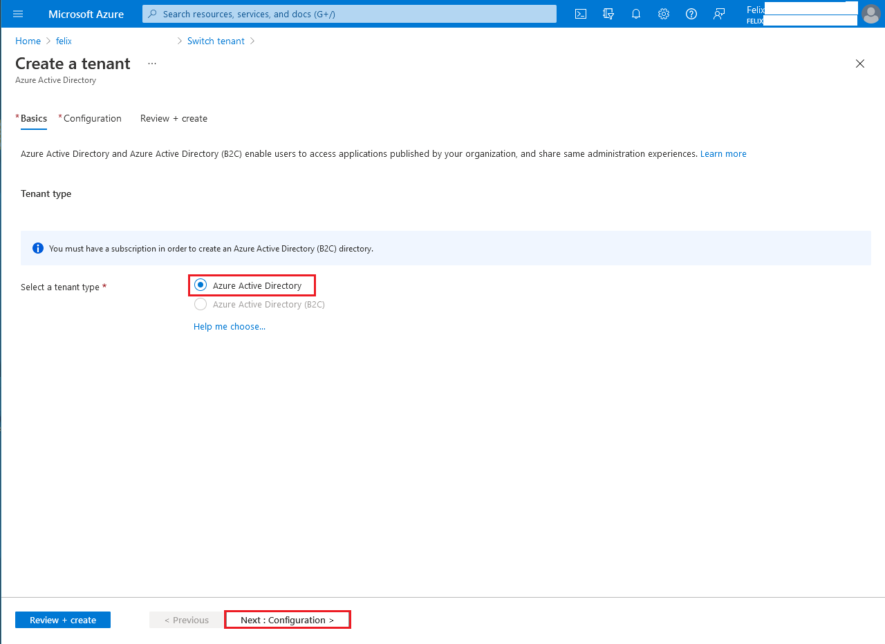
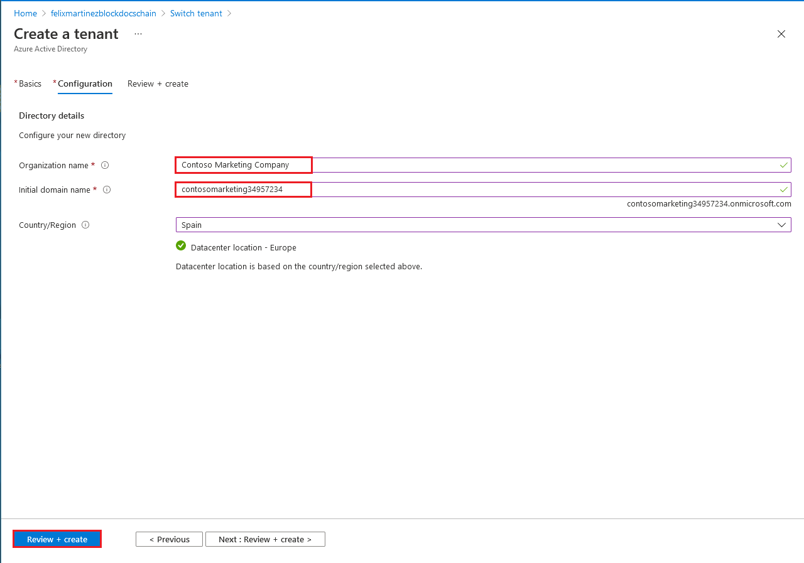
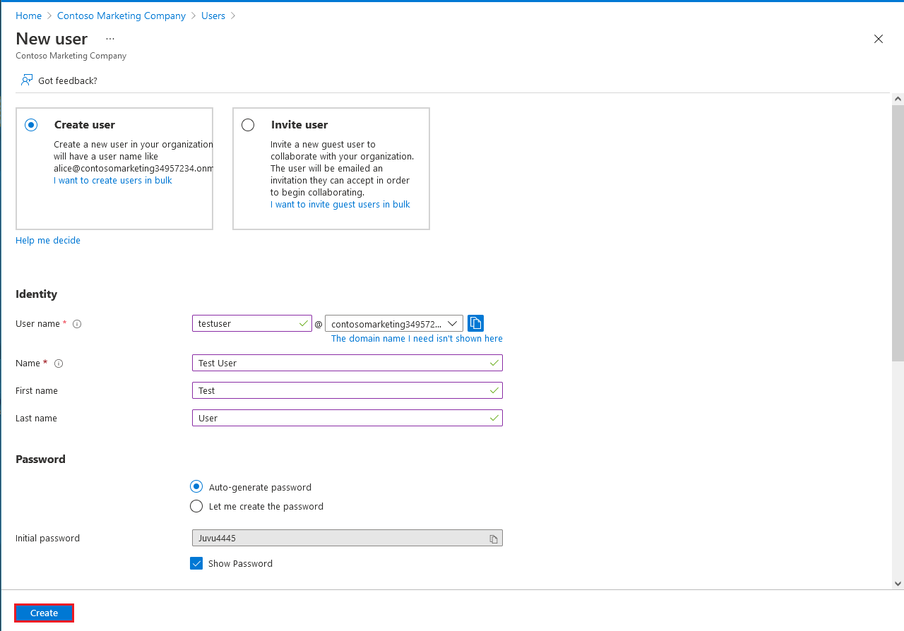
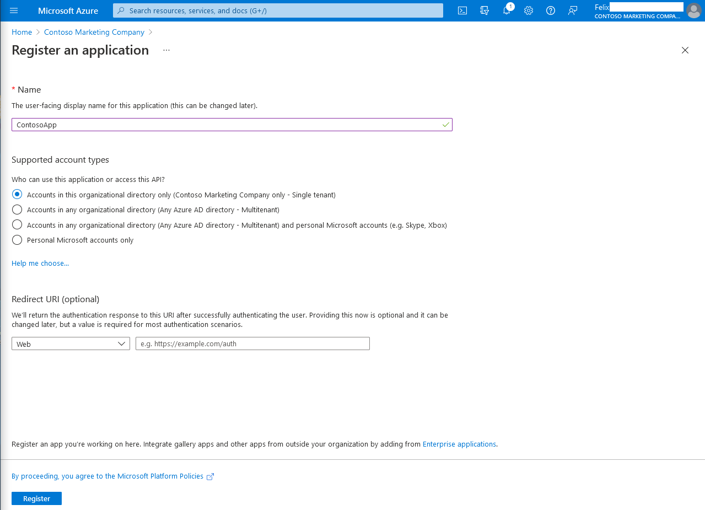
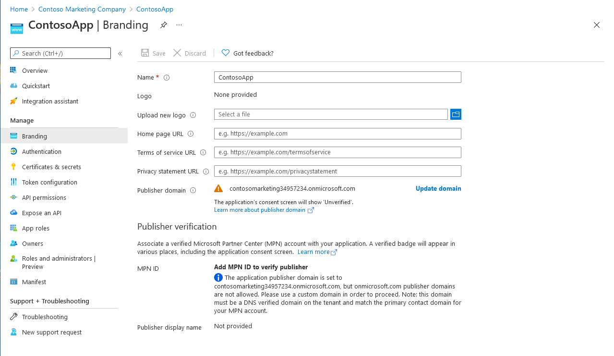

# Exercise 1: Registering an application in Azure Active Directory

## Task 2: Create an Active Directory tenant

## Task 3: Create a user in new Active Directory tenant

## Task 4: Register an application

## Task 5: Branding of the application

