# Exercise 2: Implementing authentication

## Task 1: Create application that only allows single organization sign in

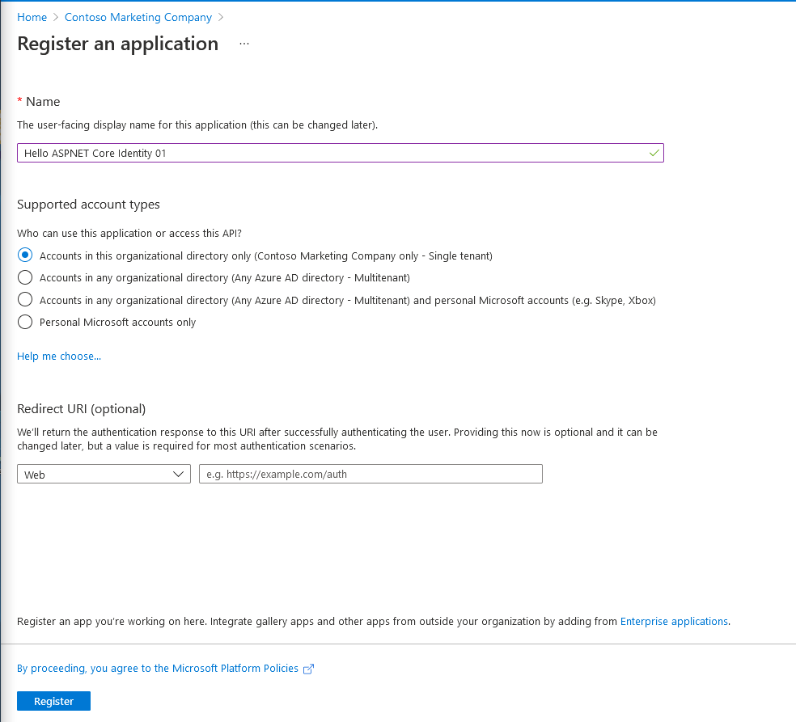

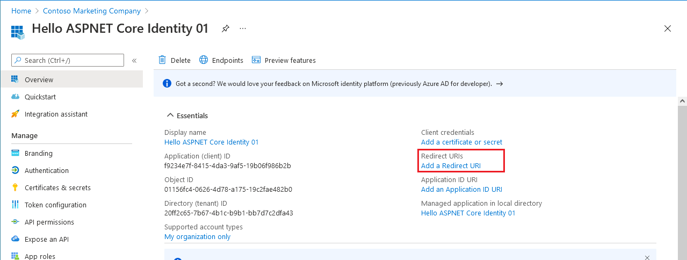

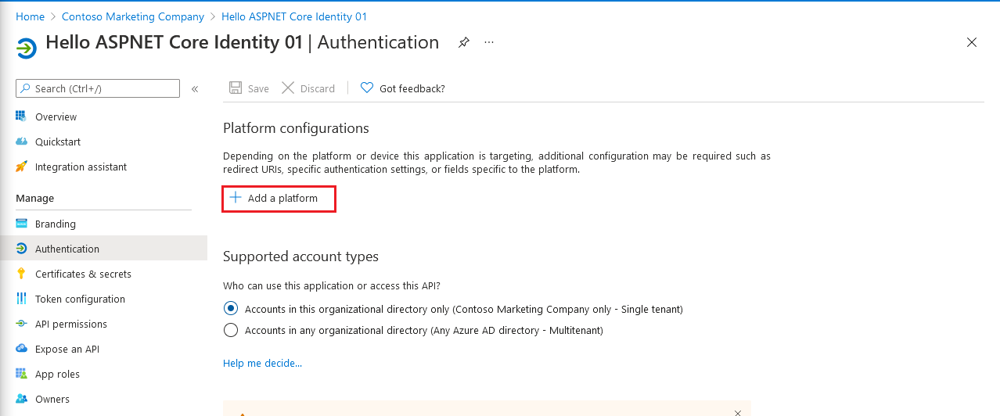

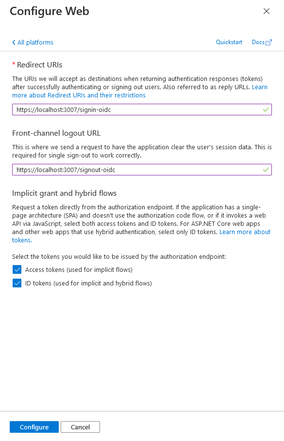

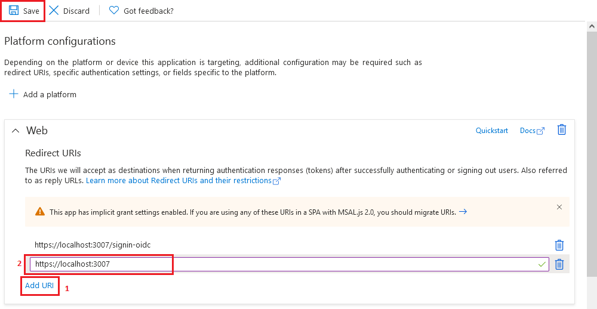

## Task 2: Create a single organization ASP.NET core web application

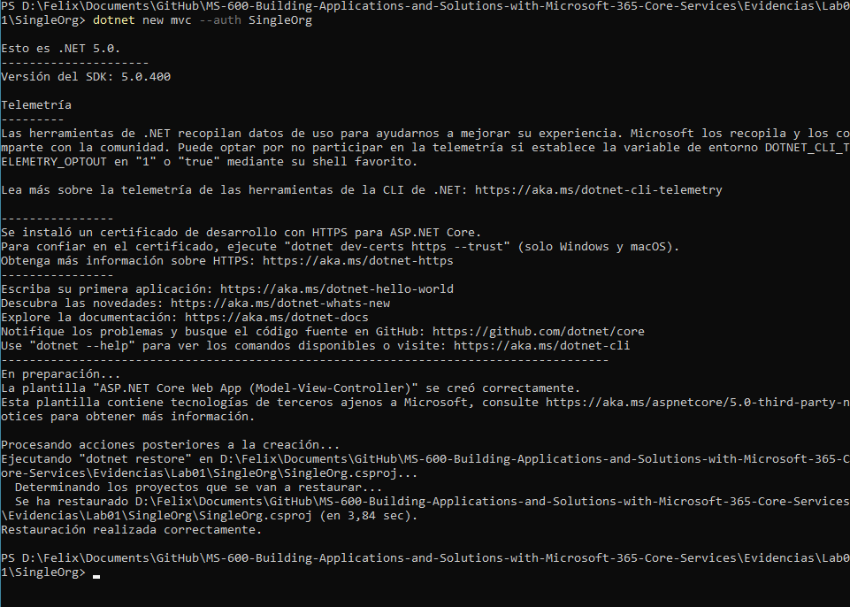

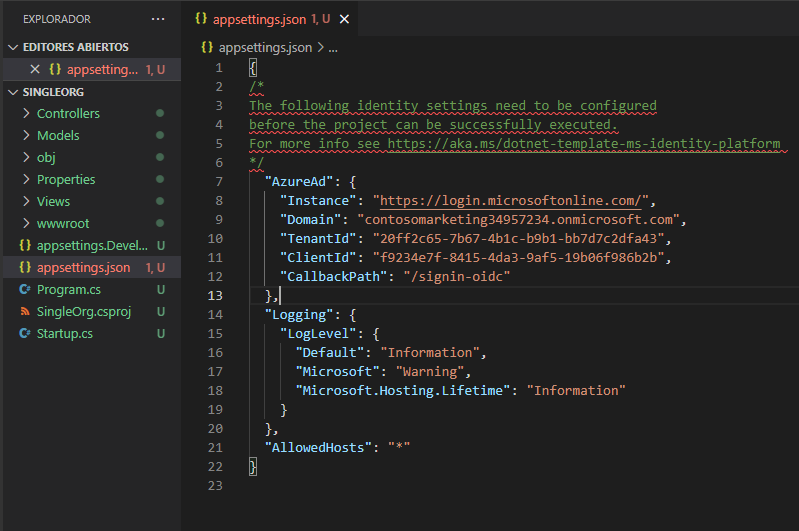

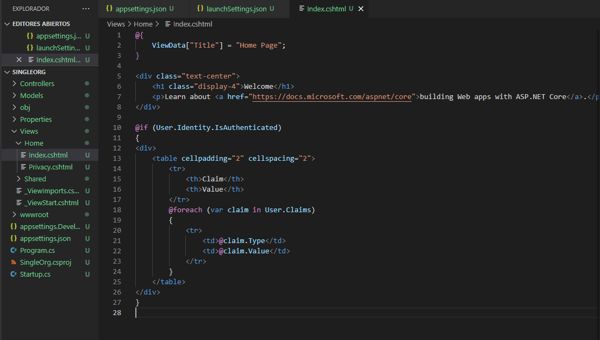

## Task 3: Build and test the single organization web app

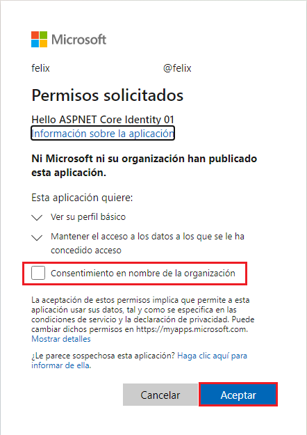

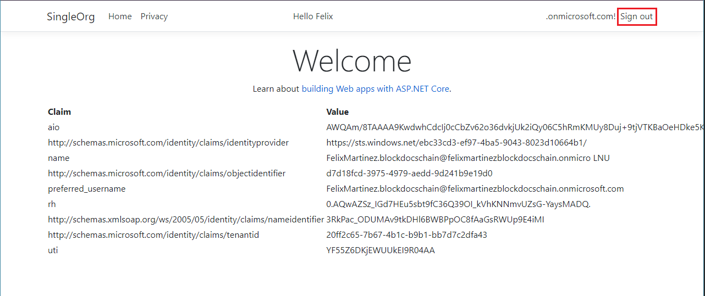

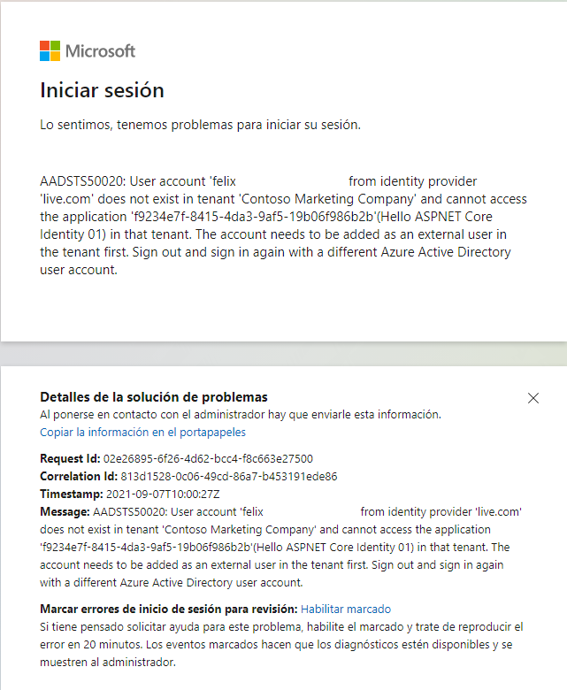

## Task 4: Create application that allows any organization's users to sign in

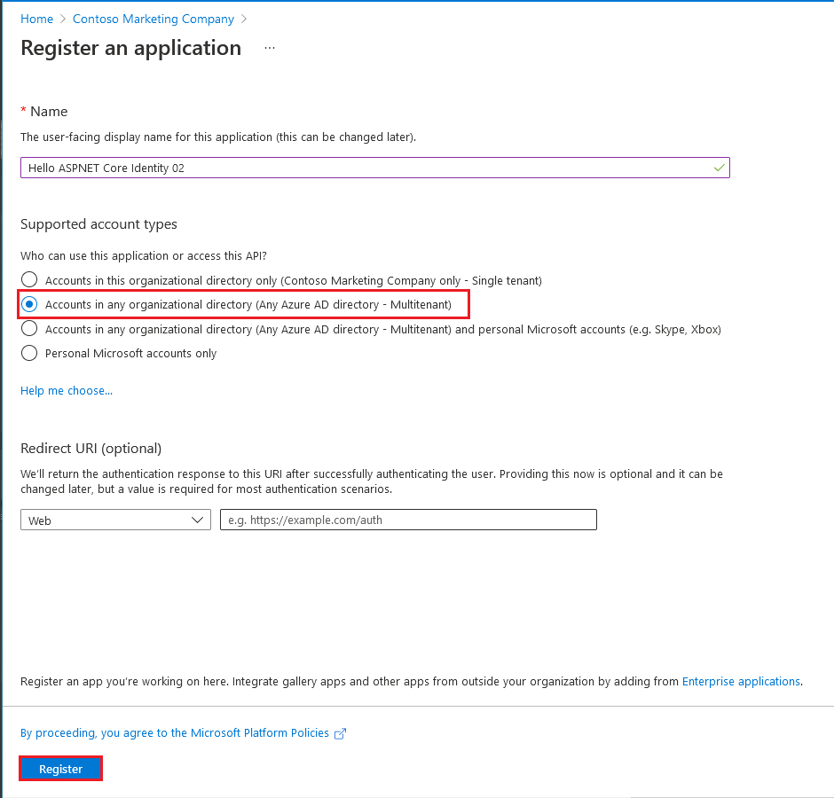

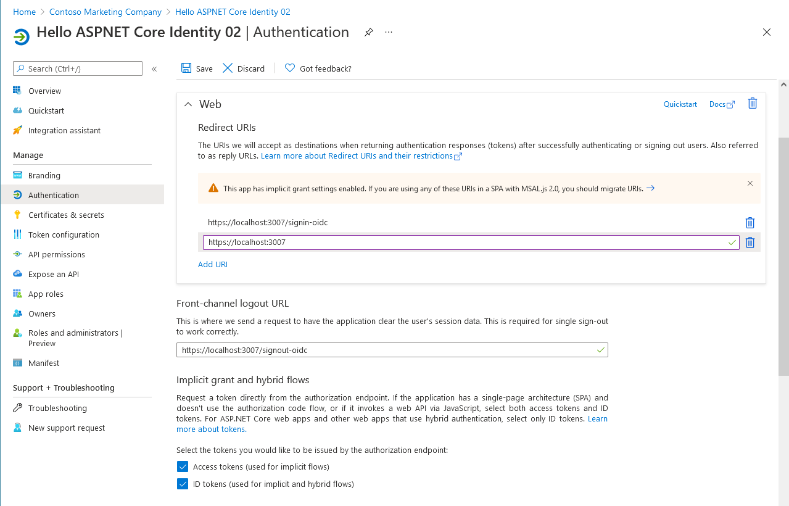

## Task 5: Create a multiple organization ASP.NET core web application

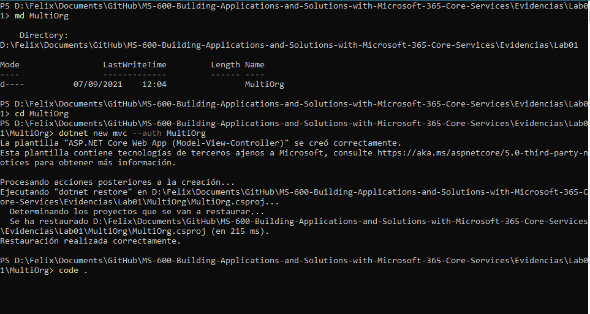

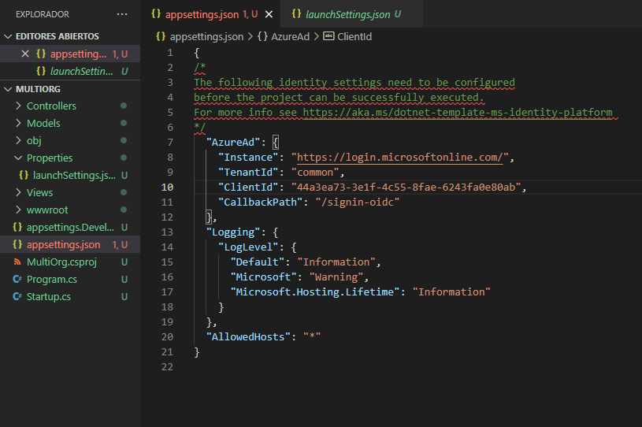

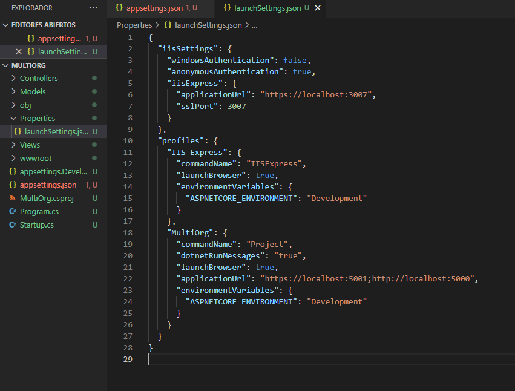

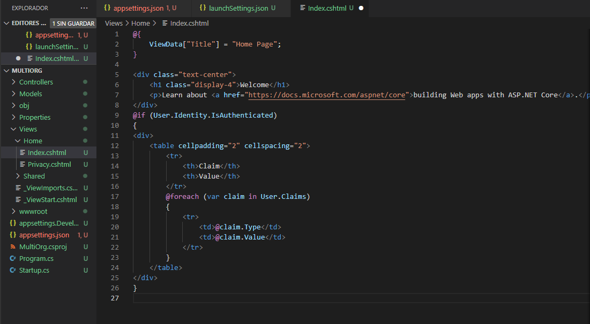

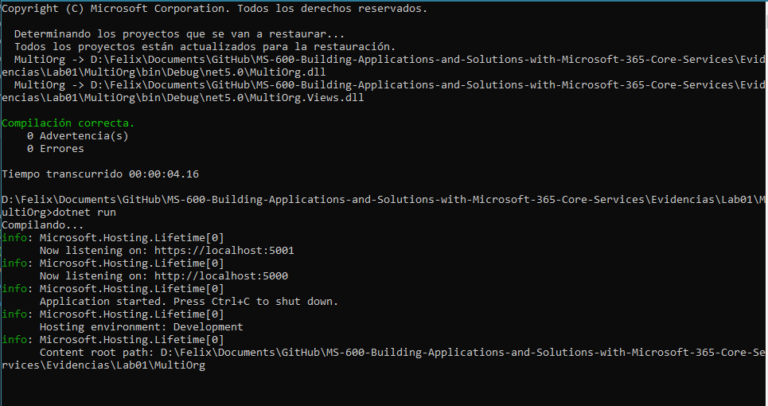

## Task 6: Build and test the multiple organization web app

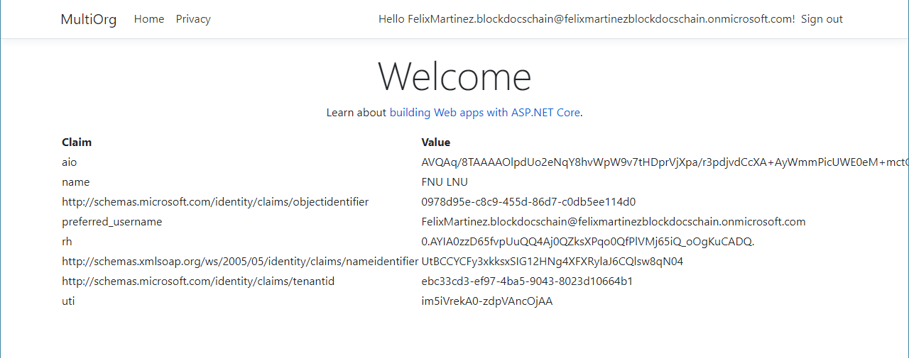

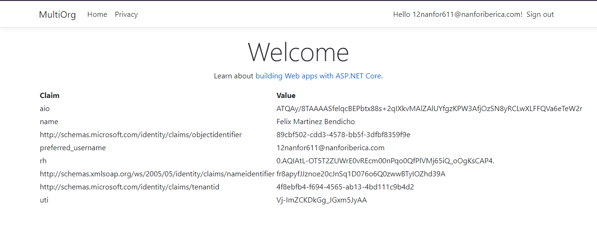
