# Exercise 3: Implementing application that supports B2B

## Task 1: Create a single-tenant Azure AD application

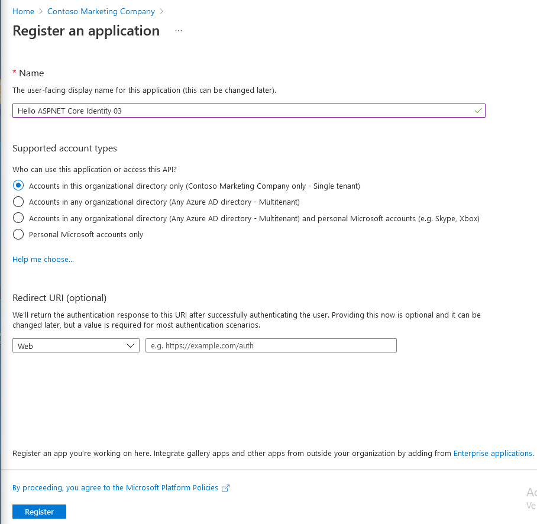

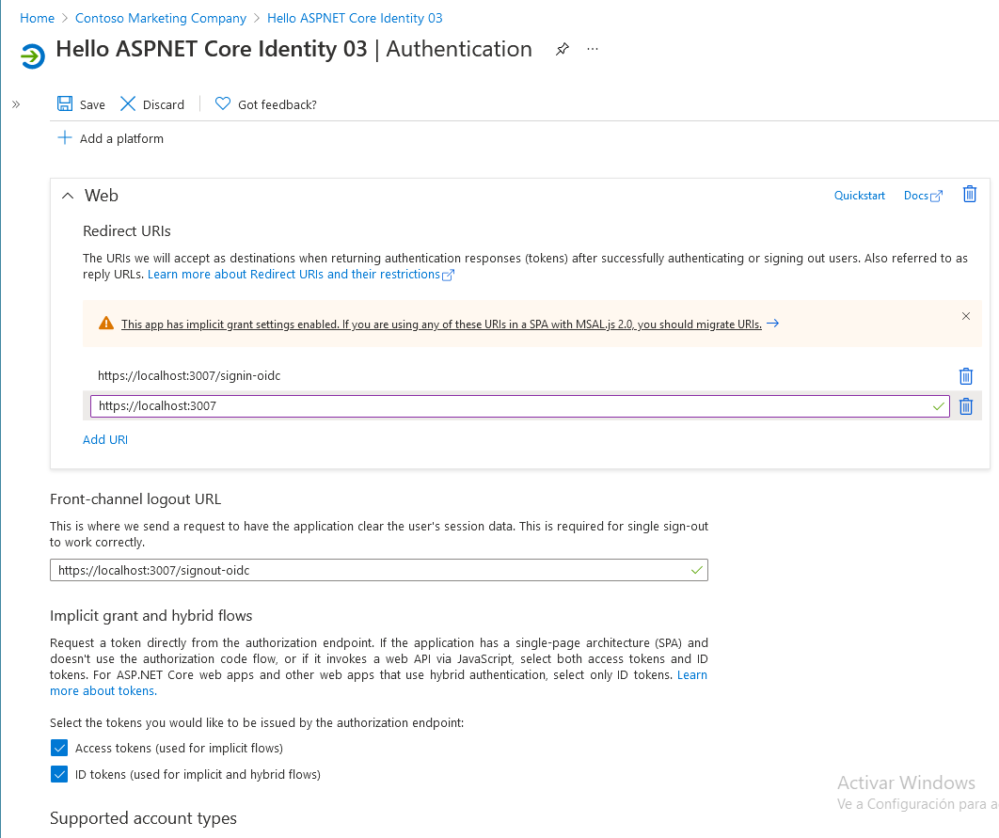

## Task 2: Create a single organization ASP.NET core web application

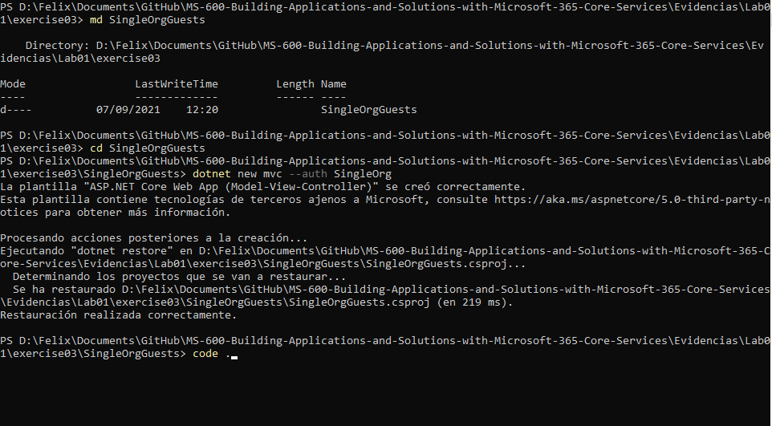

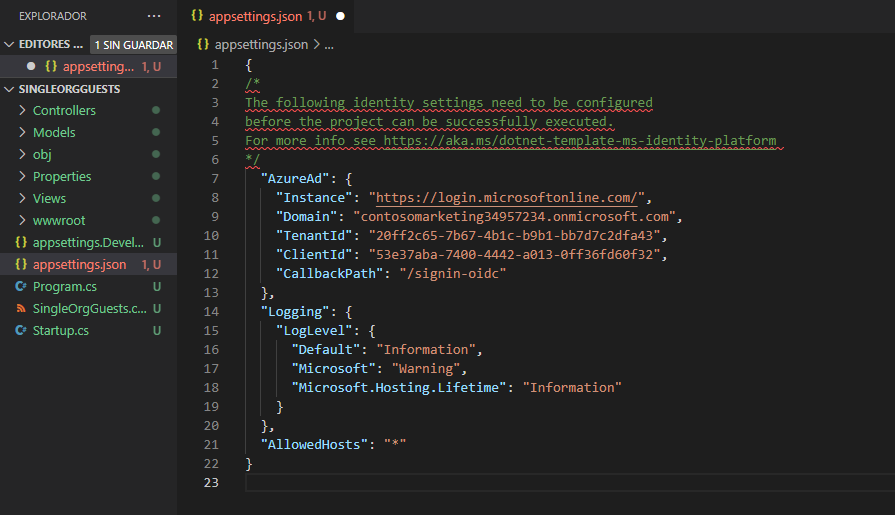

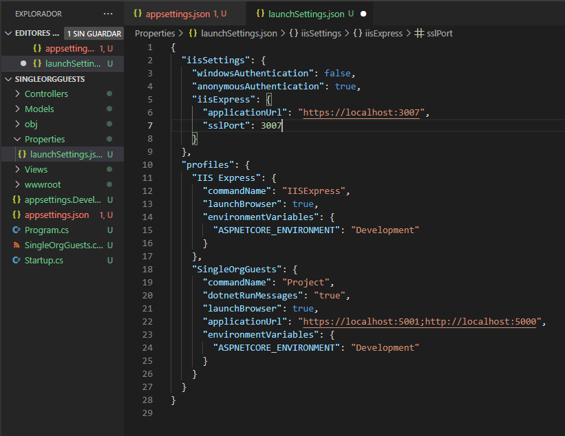

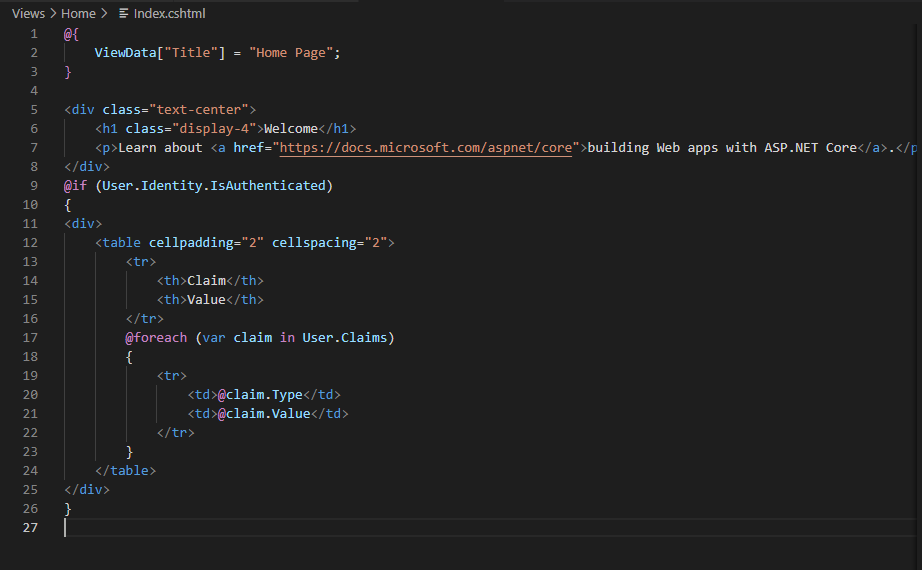

## Task 3: Build and test the app

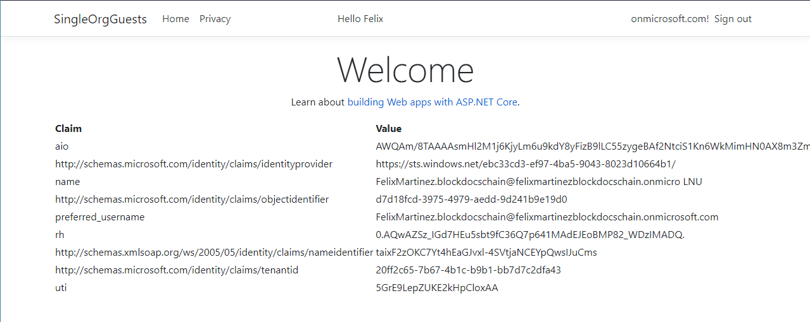

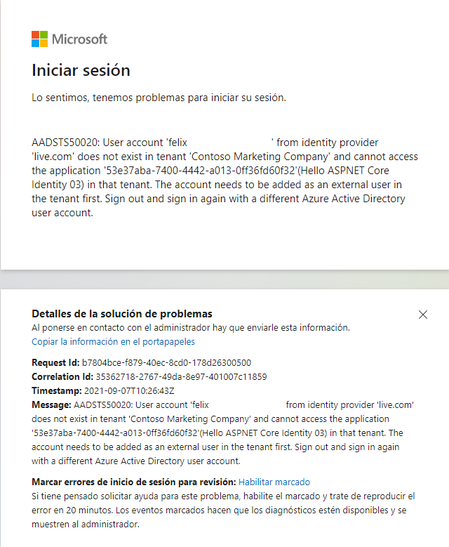

## Task 4: Invite a guest user from another organization

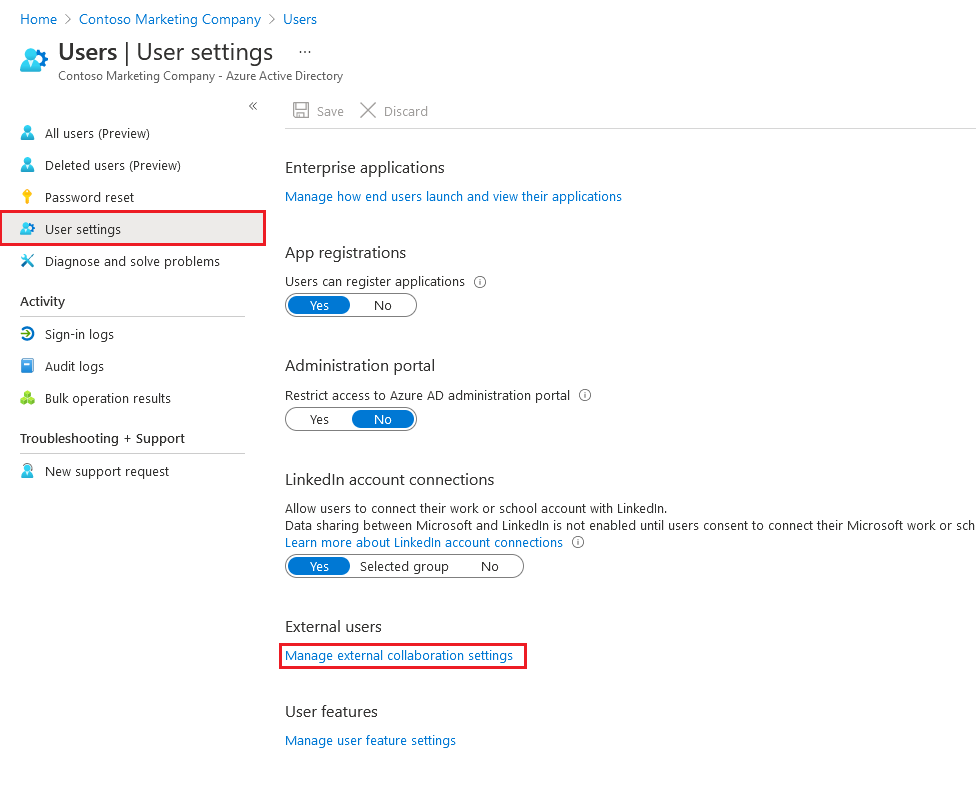

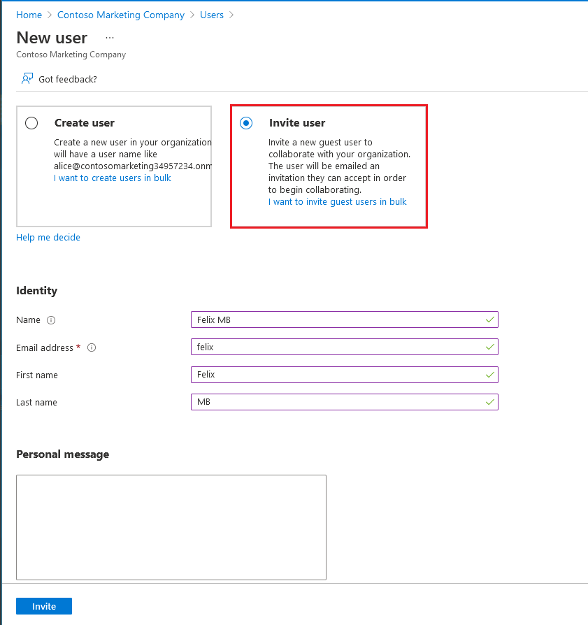

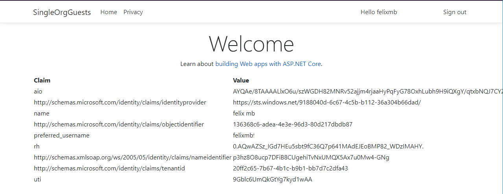
