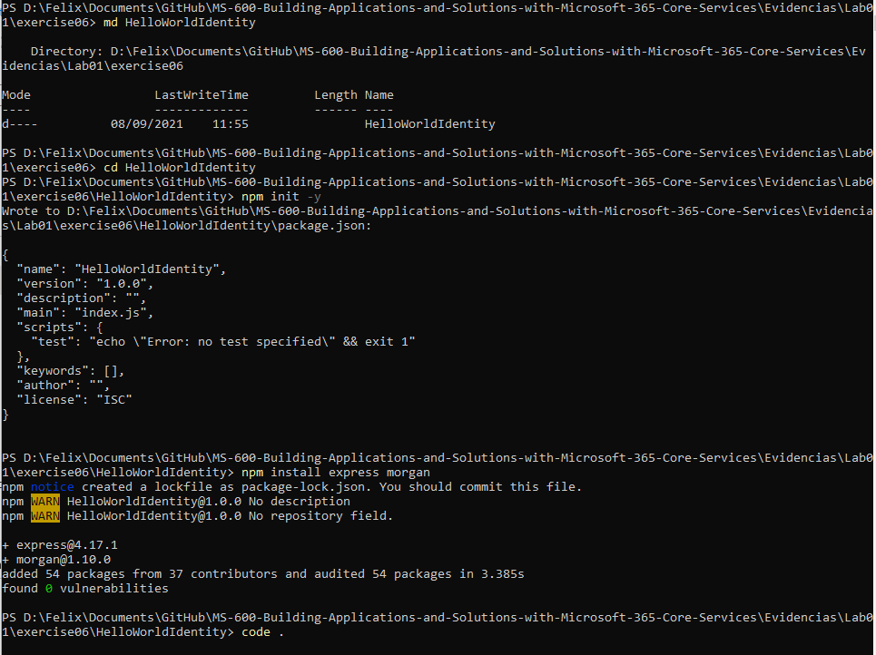
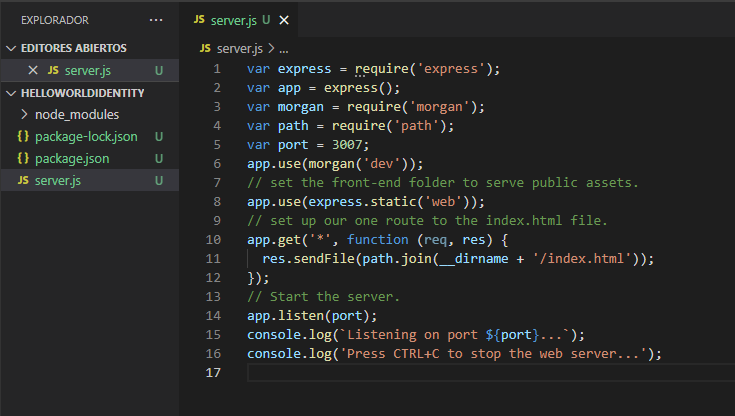
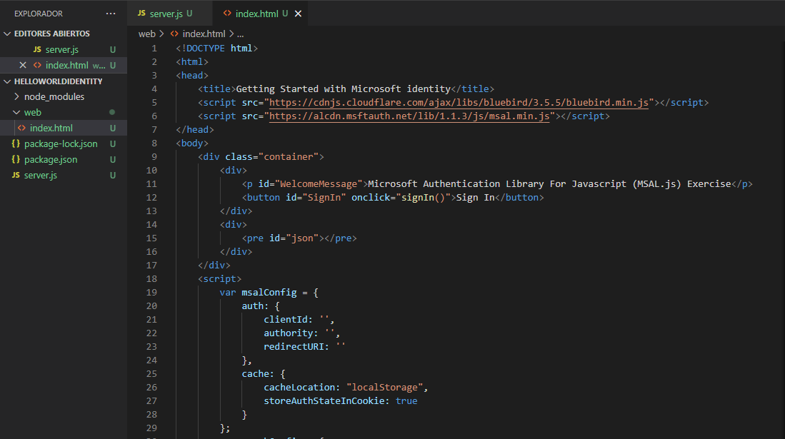
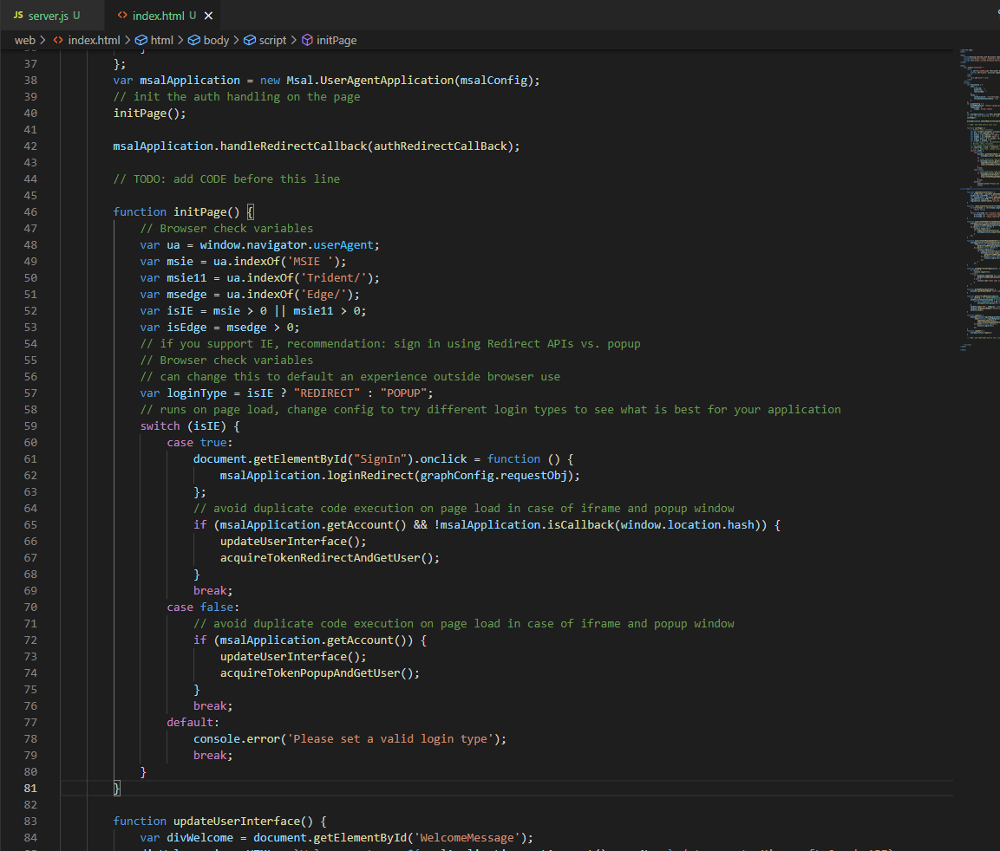
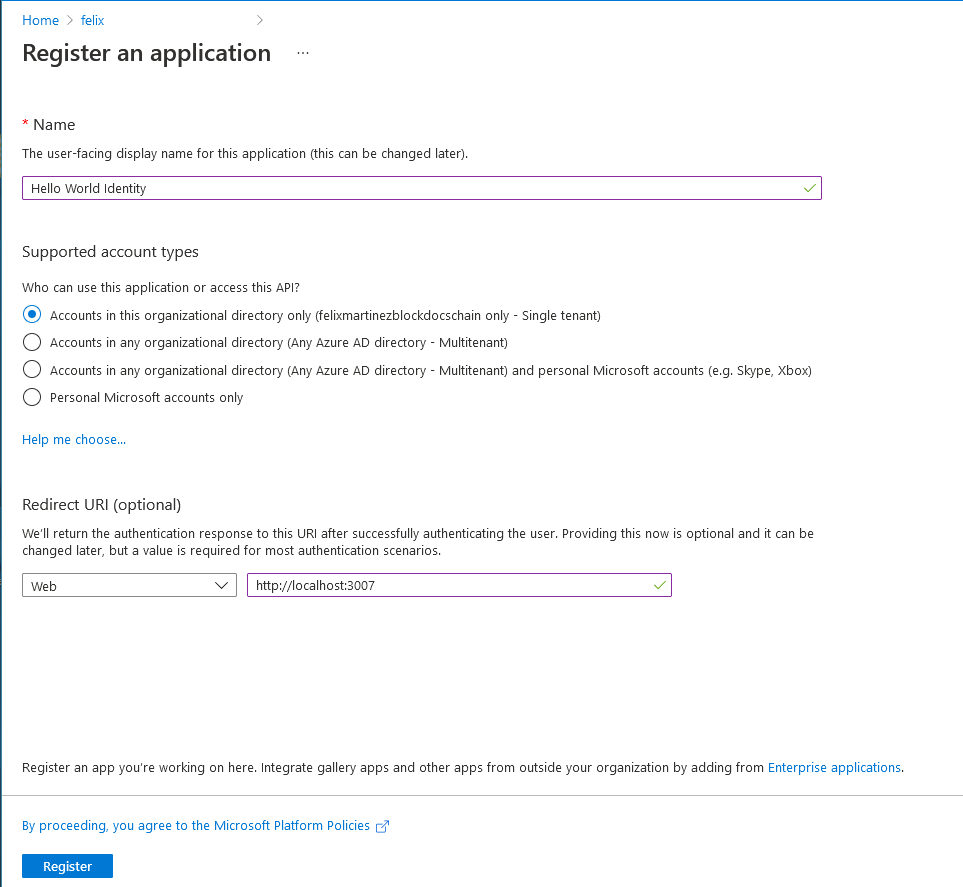
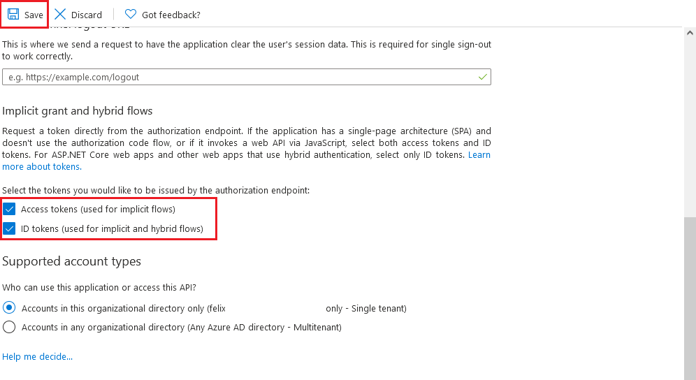
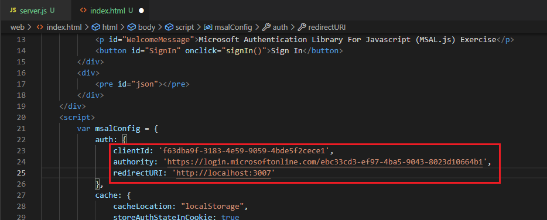
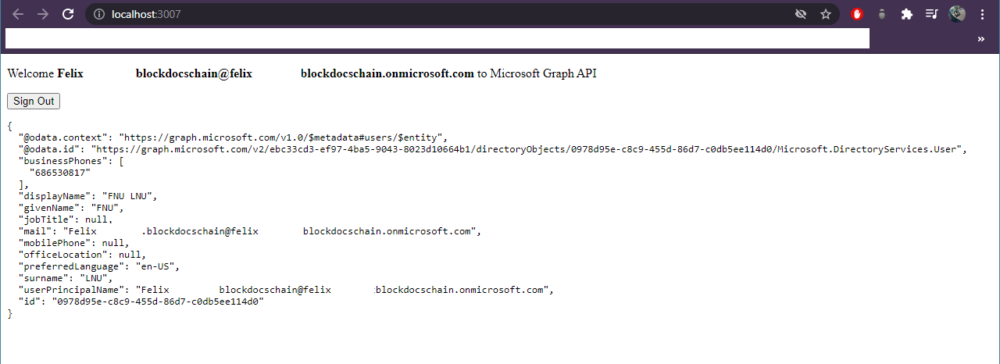
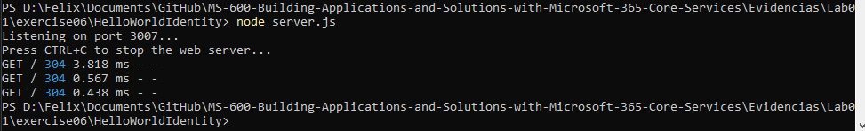

# Exercise 6: Creating a service to access Microsoft Graph

## Task 1: Single page web application

## Task 2: Register a new application

## Task 3: Update the web page with the Azure AD application details

## Task 4: Test the web application

