# Exercise 1: Using query parameters when querying Microsoft Graph via HTTP

## Task 1: Go to the Graph Explorer

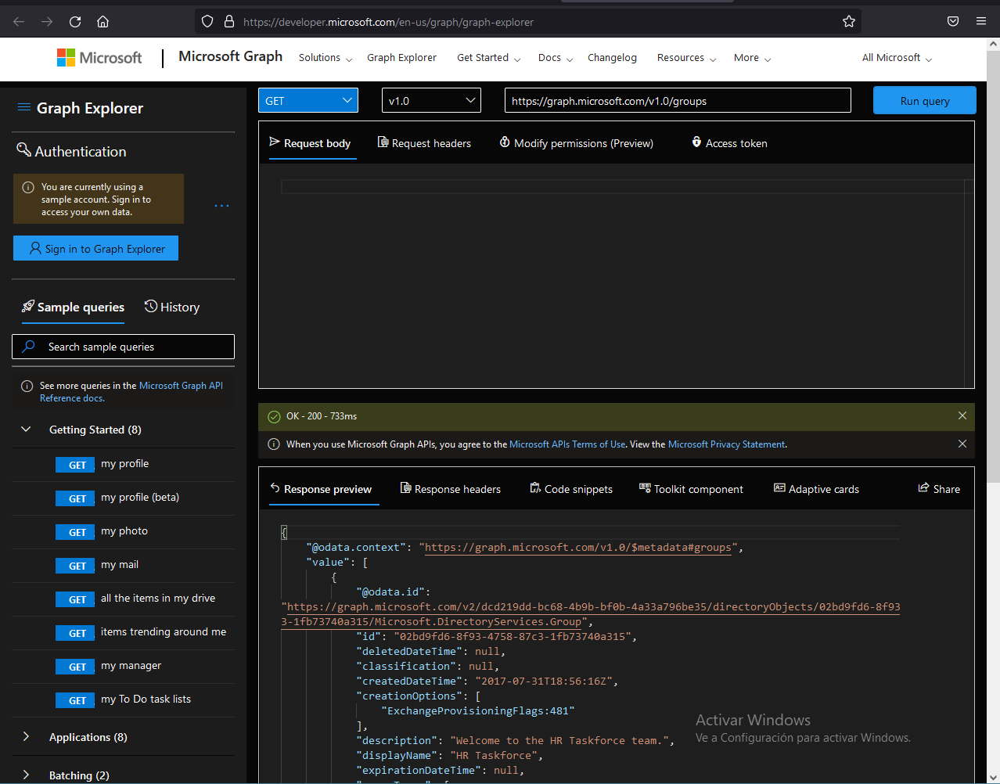

## Task 2: Use /$select to retrieve only some object properties

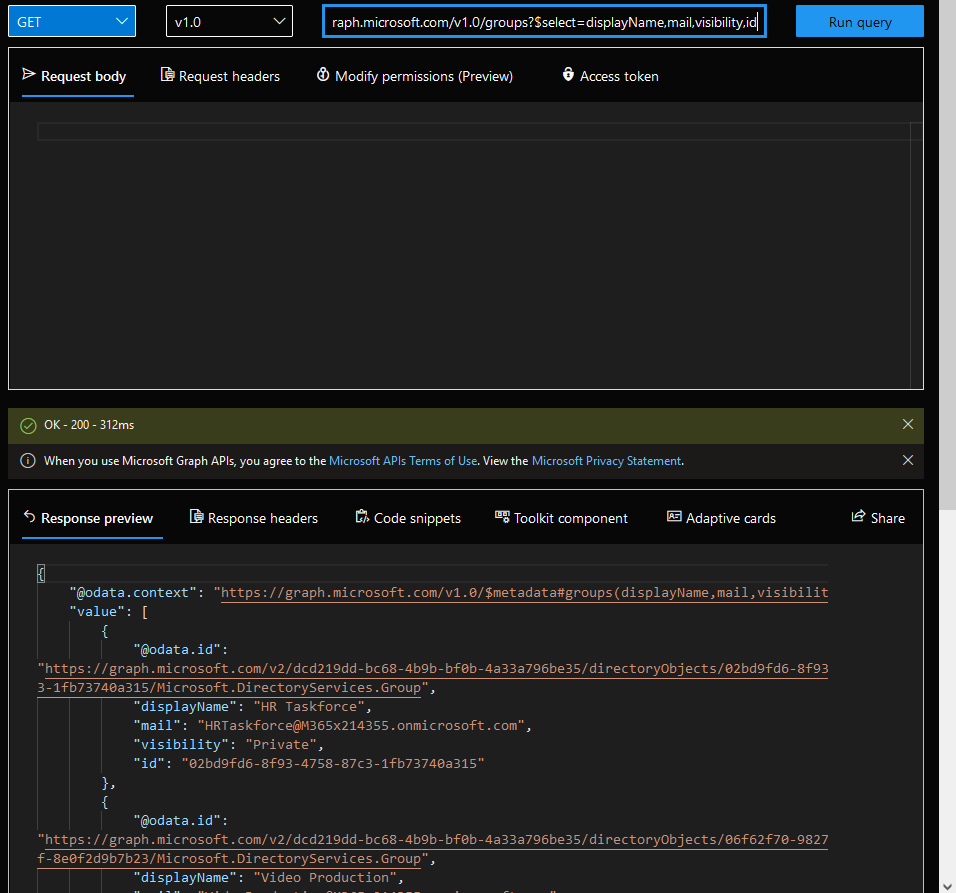

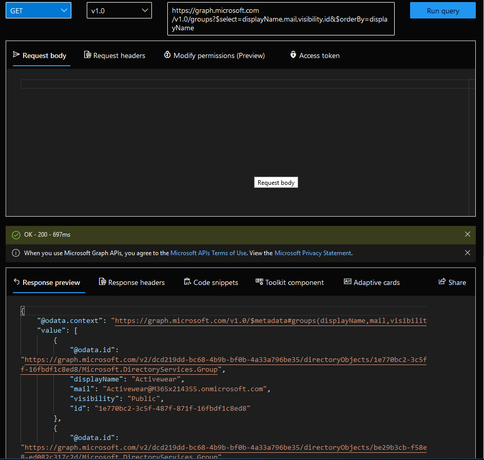

## Task 4: Use /$filter to retrieve a subset of data available

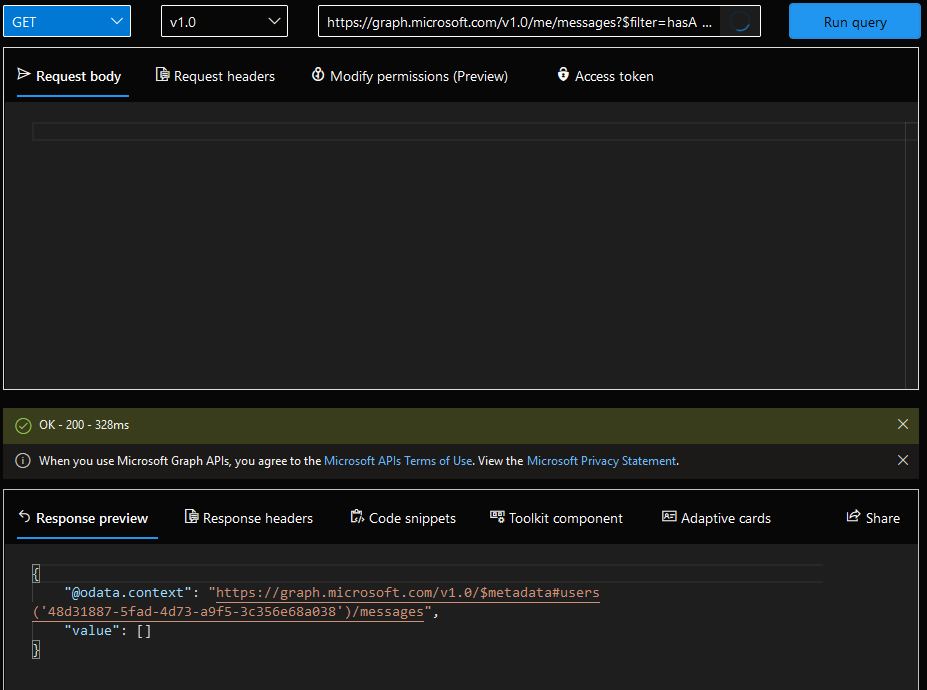

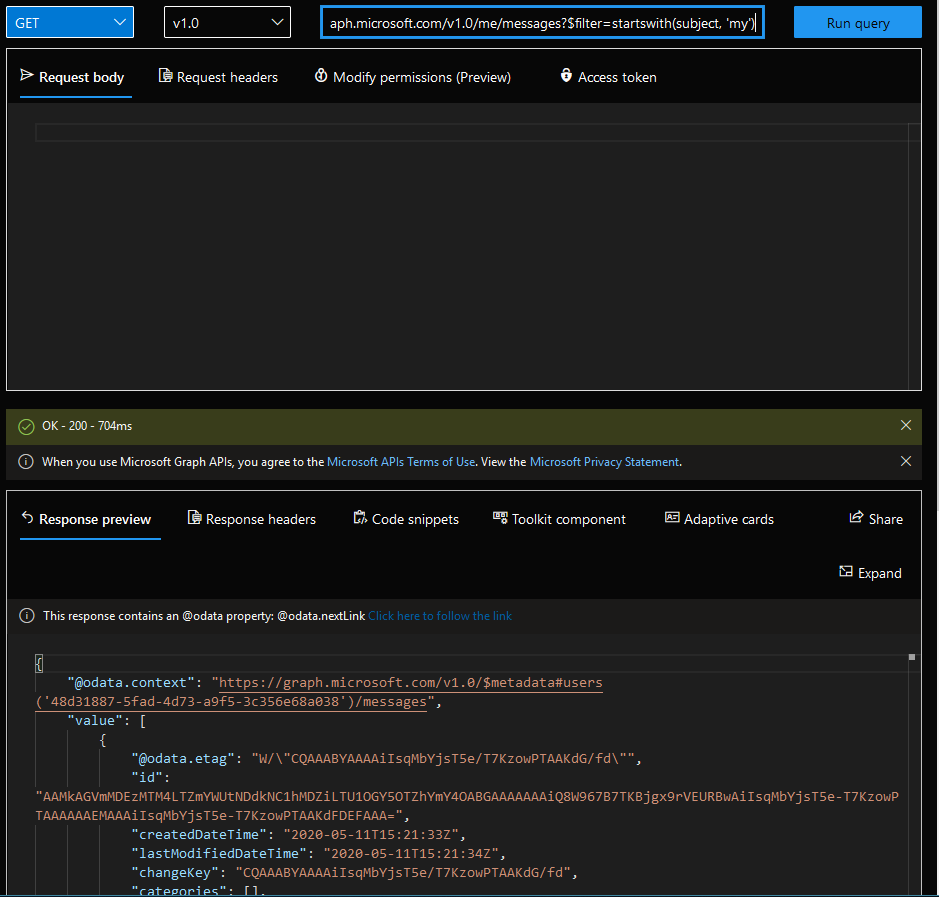

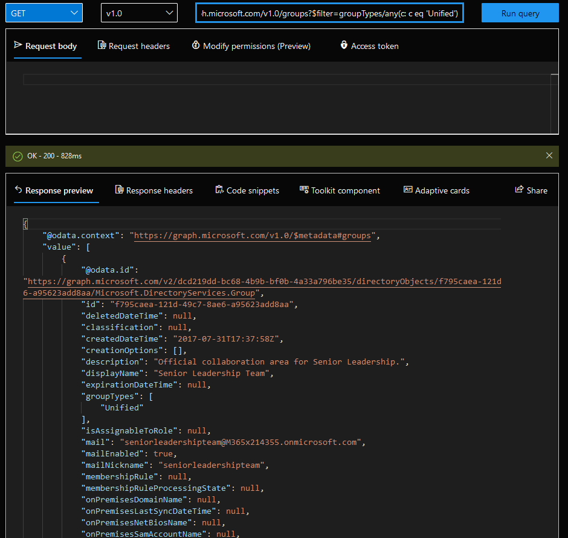

## Task 5: Use /$skip and /$top for explicit pagination of results

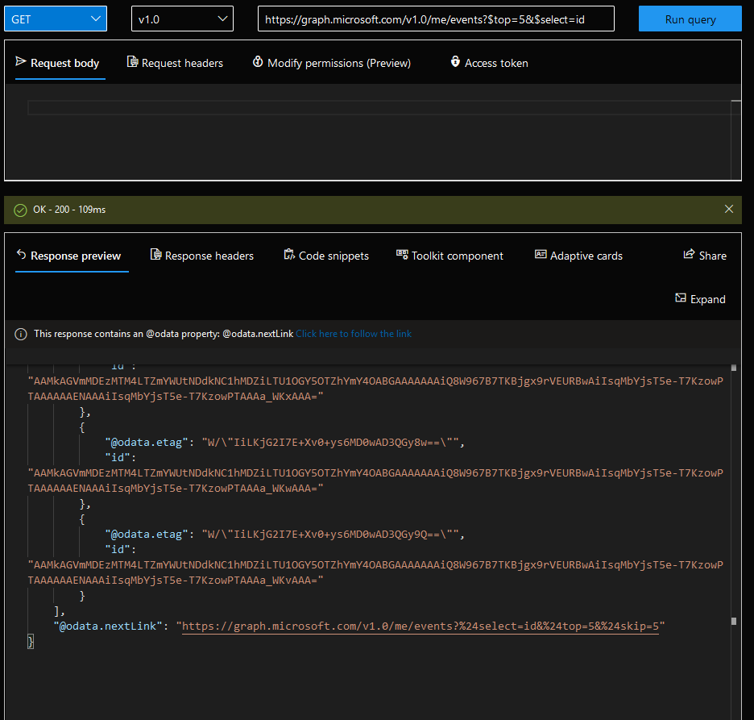

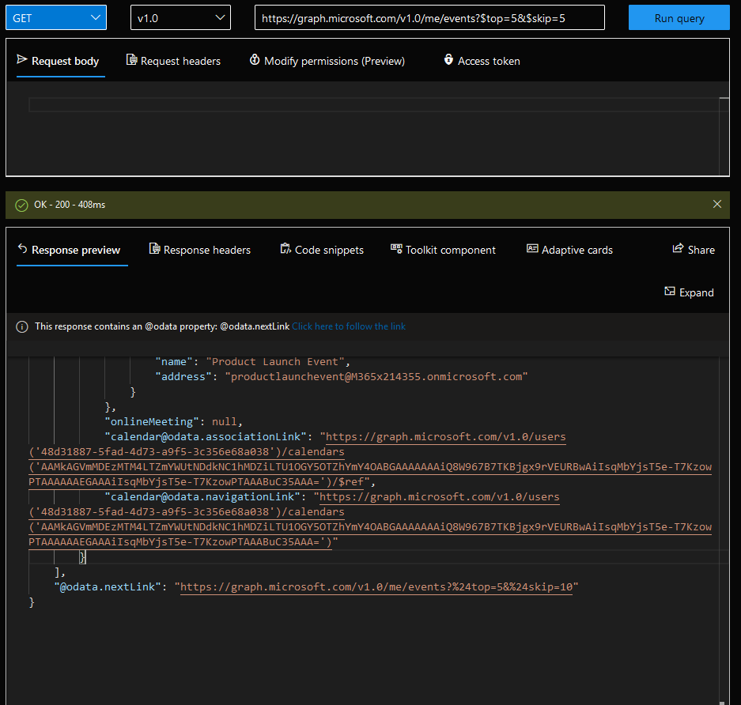

## Task 6: Expand and retrieve resources using /$expand query parameter

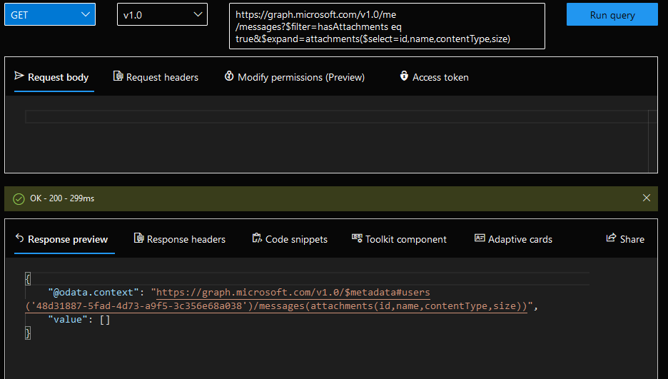

## Task 7: Use /$count to discover the total number of matching resources

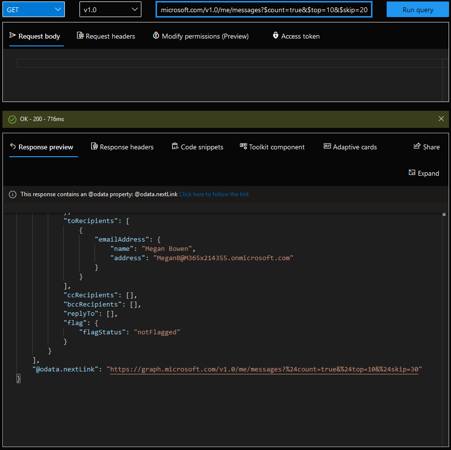

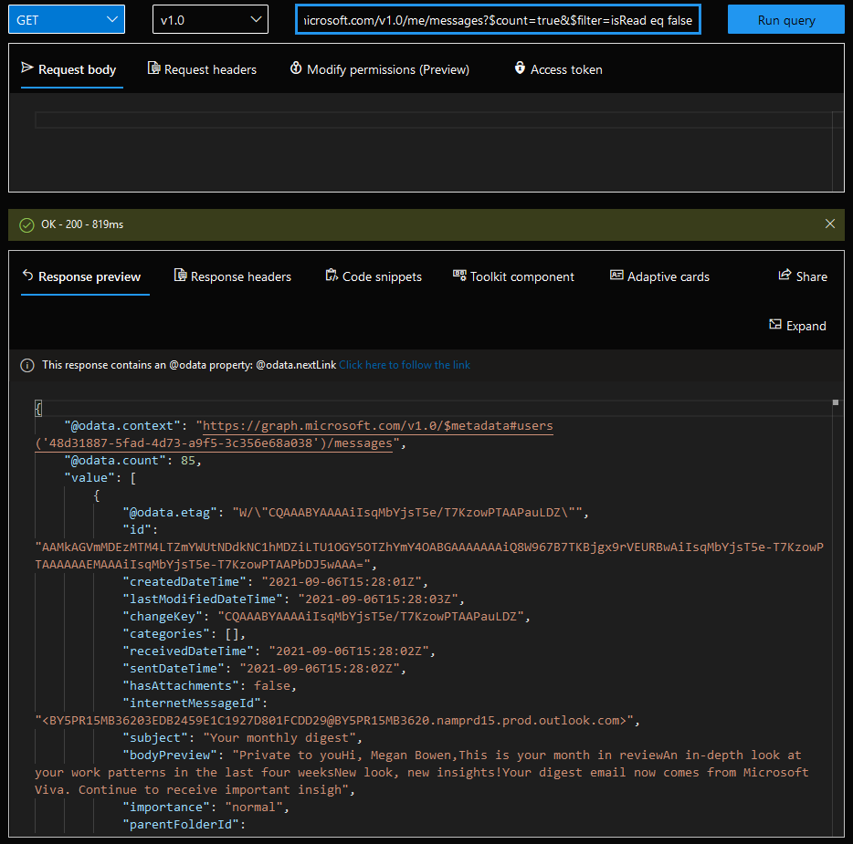
