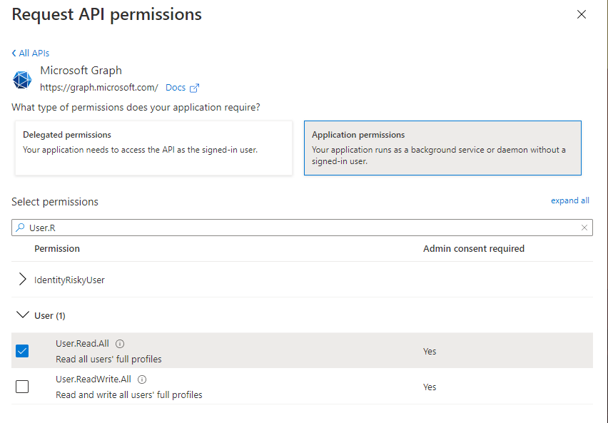
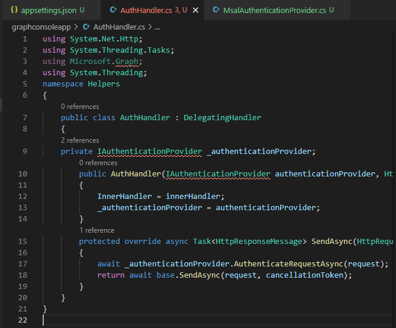

# Exercise 2: Retrieve and control information returned from Microsoft Graph

## Task 1: Create an Azure AD application

## Task 2: Create .NET Core console application

## Task 3: Update the console app to support Azure AD authentication

## Task 6: Build and test the application

