# Exercise 3: Using change notifications and track changes with Microsoft Graph

## Task 1: Create a new Azure AD web application

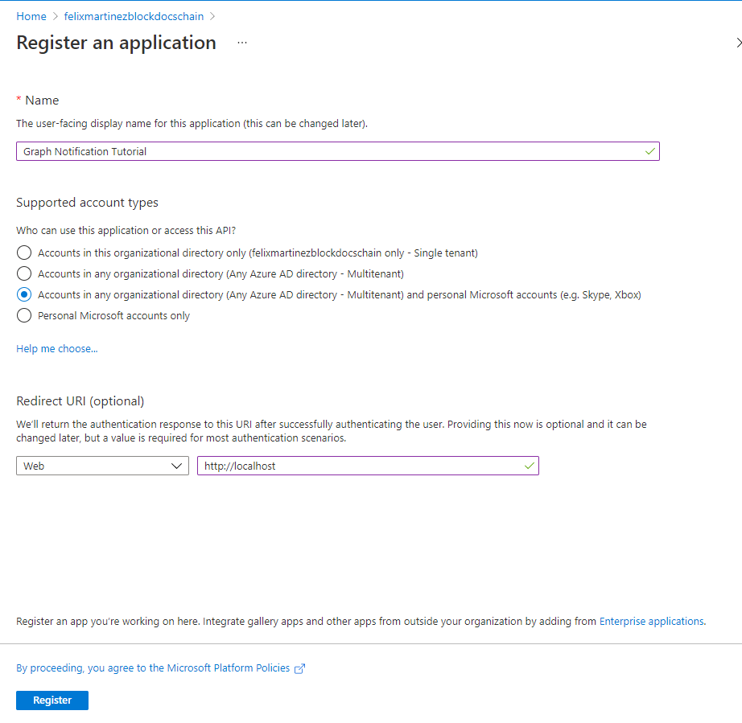

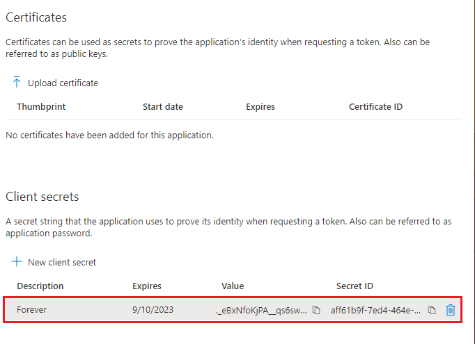

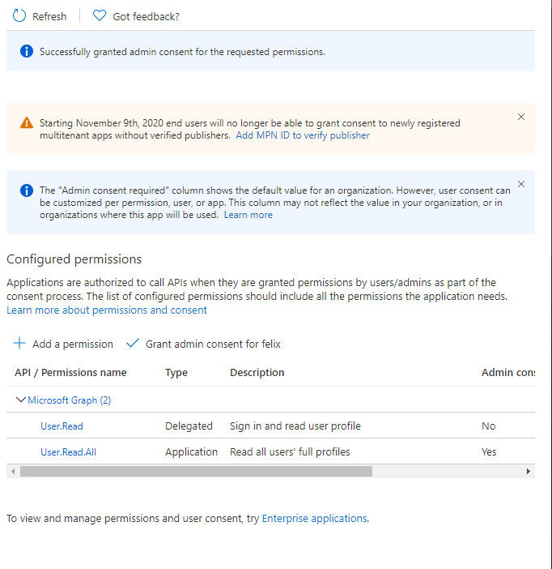

## Task 2: Create .NET Core App

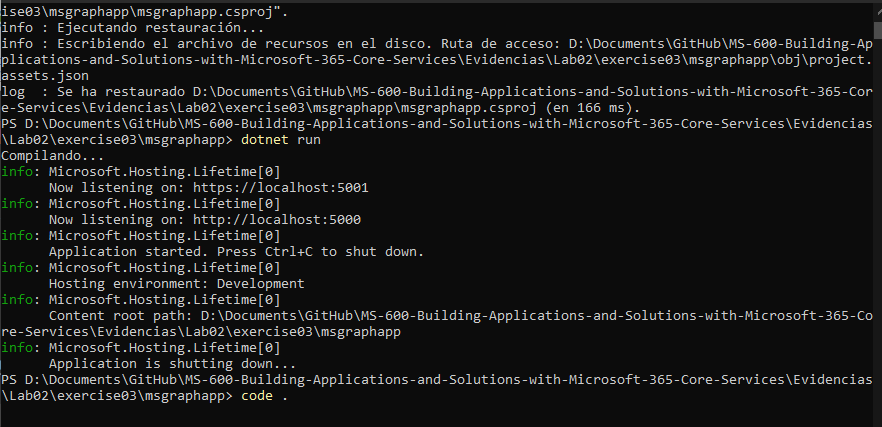

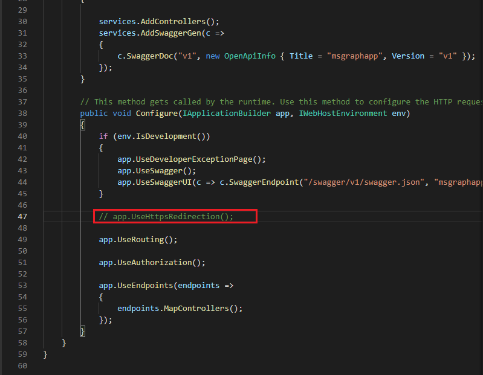

## Task 3: Code the HTTP API

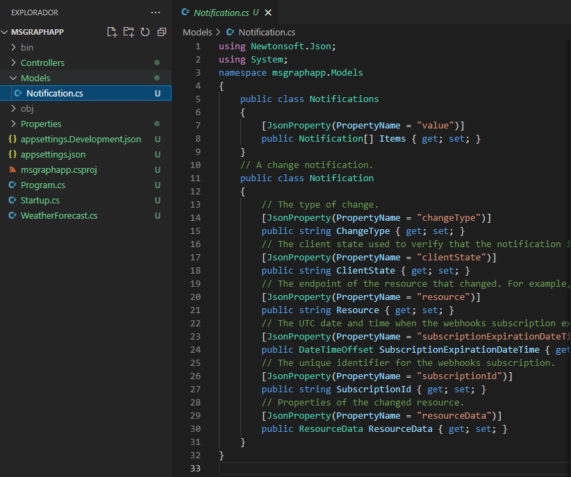

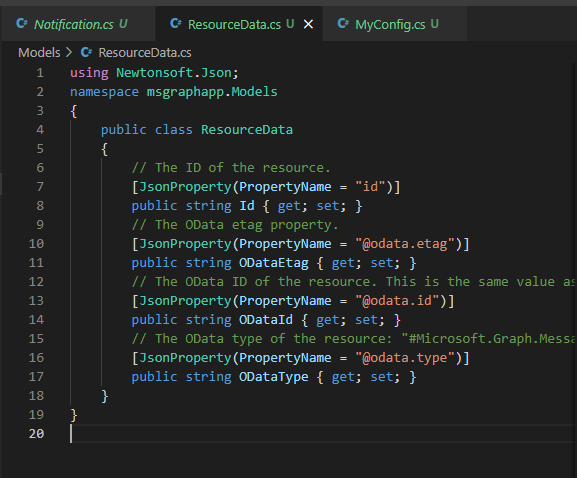

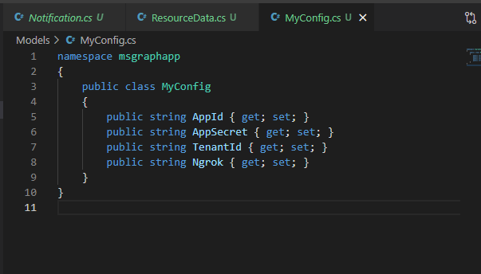

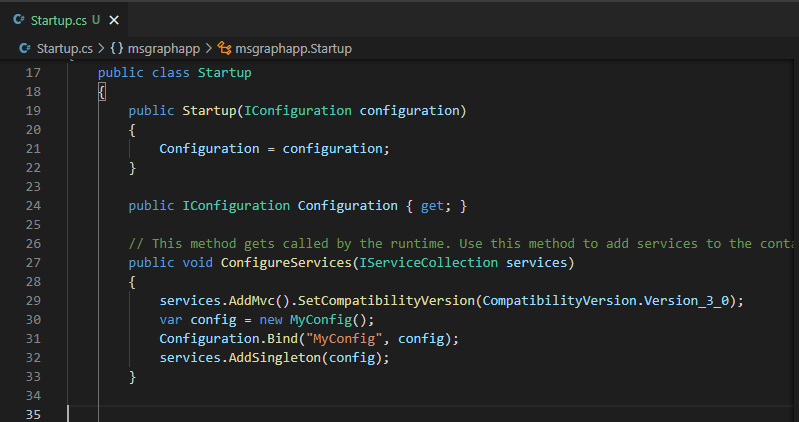

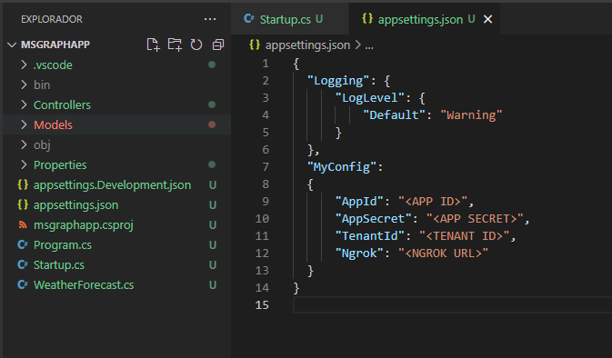

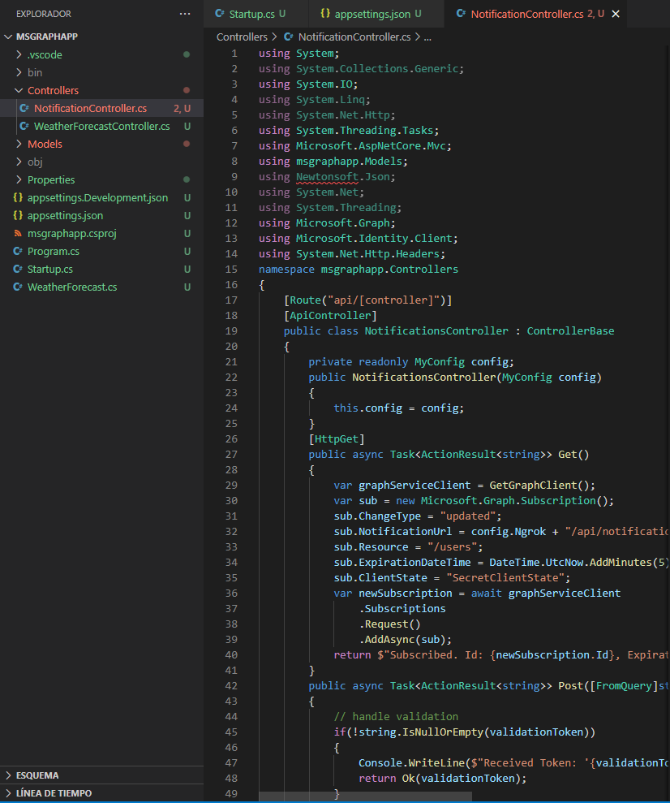

## Task 4: Run the application

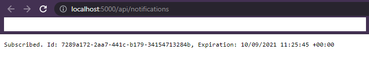

## Task 5: Manage notification subscriptions

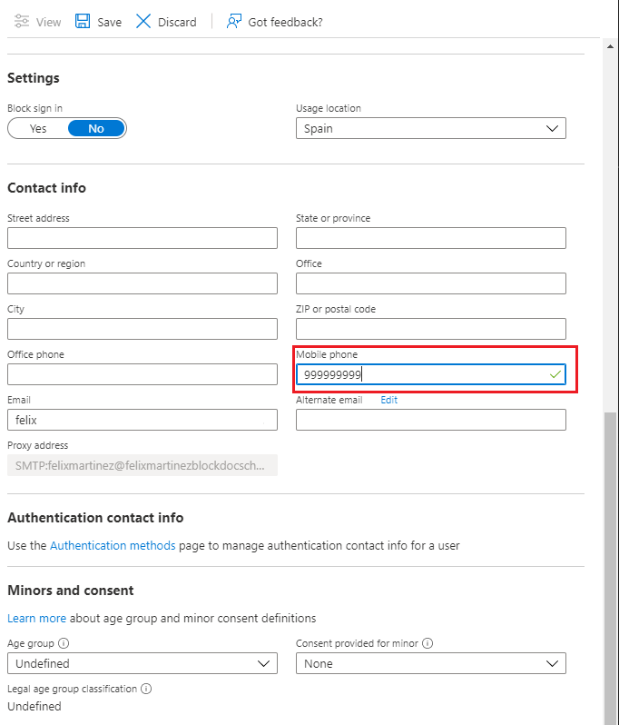

## Task 6: Query for changes

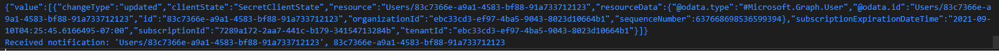

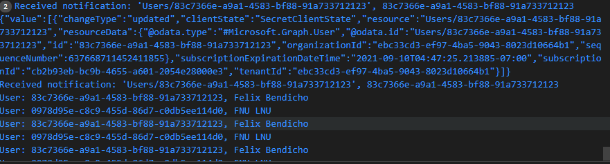

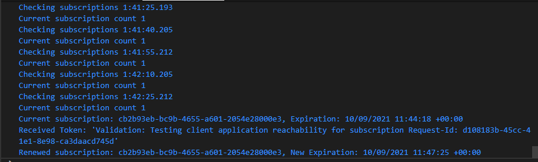

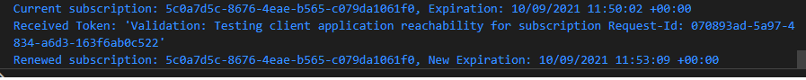
