# Exercise 5: Understand throttling in Microsoft Graph

## Task 1: Create an Azure AD application

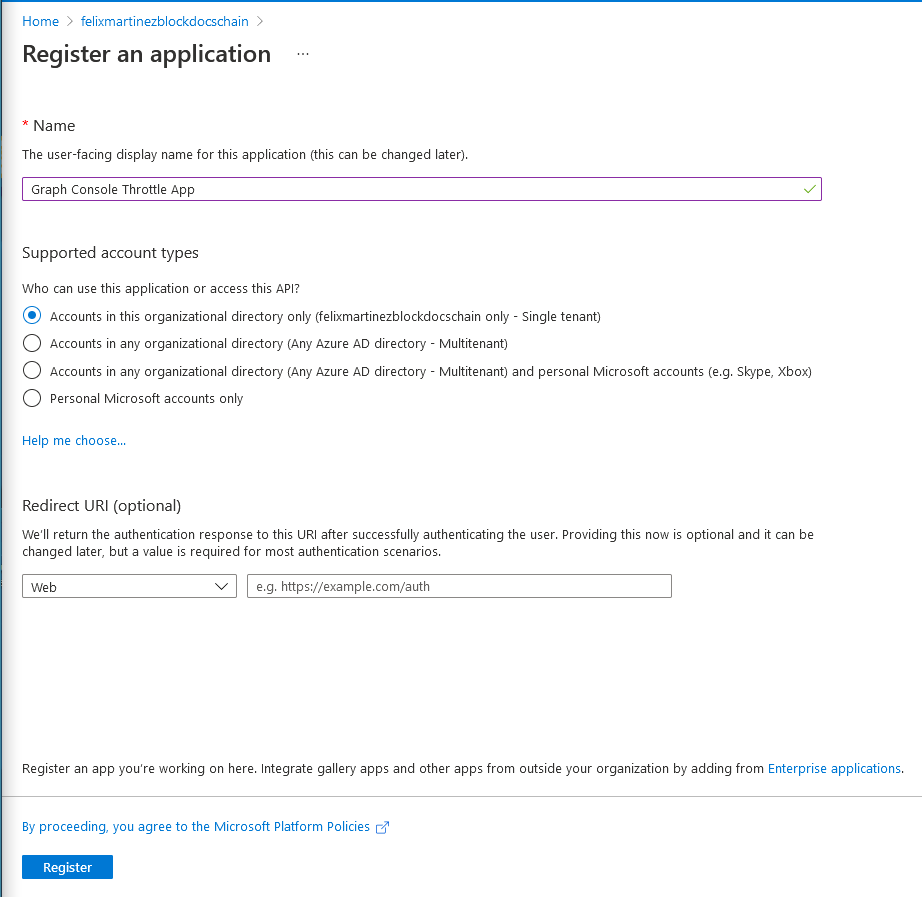

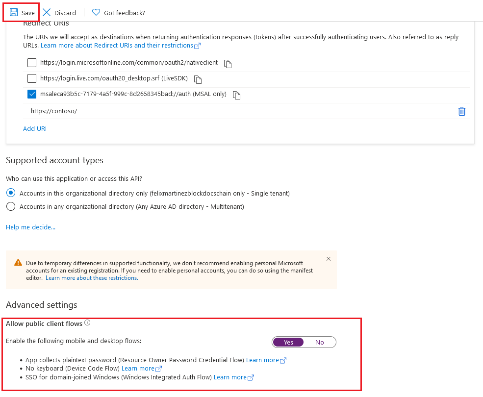

## Task 2: Grant Azure AD application permissions to Microsoft Graph

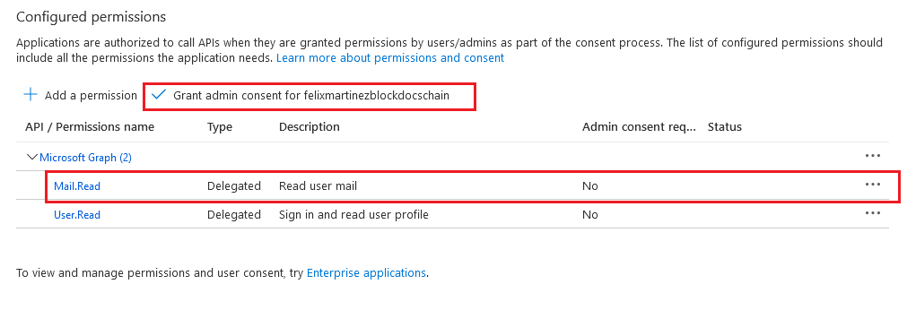

## Task 3: Create .NET Core console application

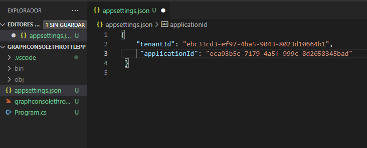

## Task 4: Update the console app to support Azure AD authentication

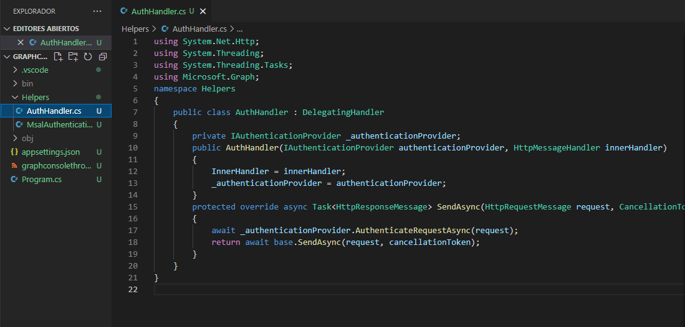

## Task 5: Create authentication helper classes

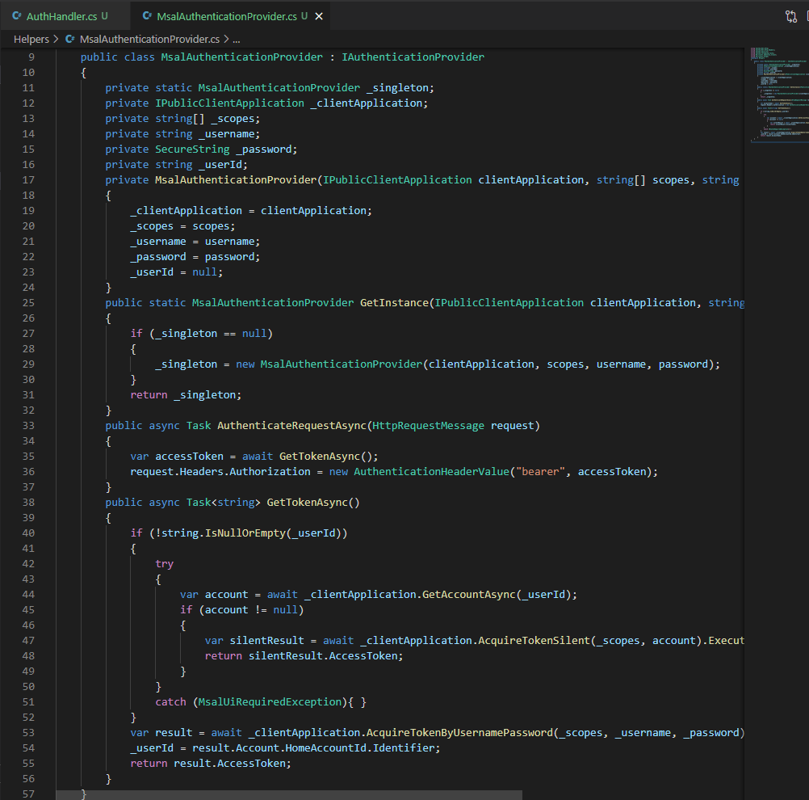

## Task 6: Incorporate Microsoft Graph into the console app

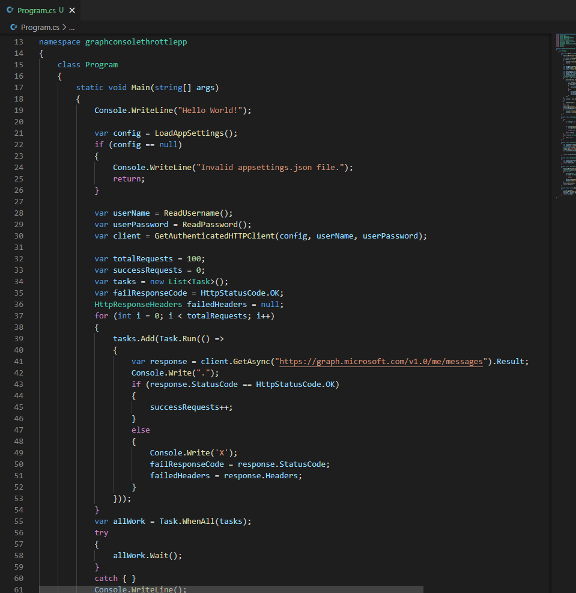

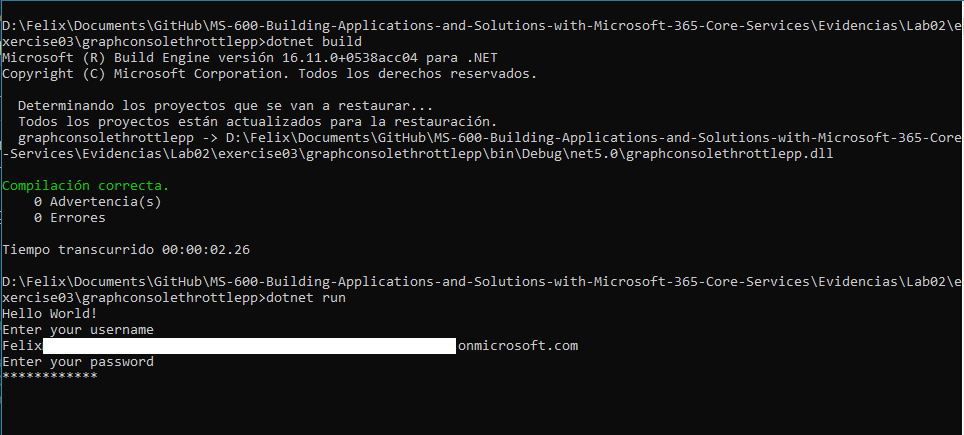

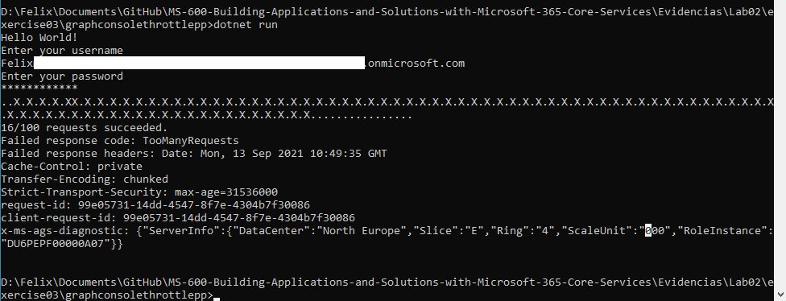

## Task 8: Implement Microsoft Graph SDK for throttling retry strategy

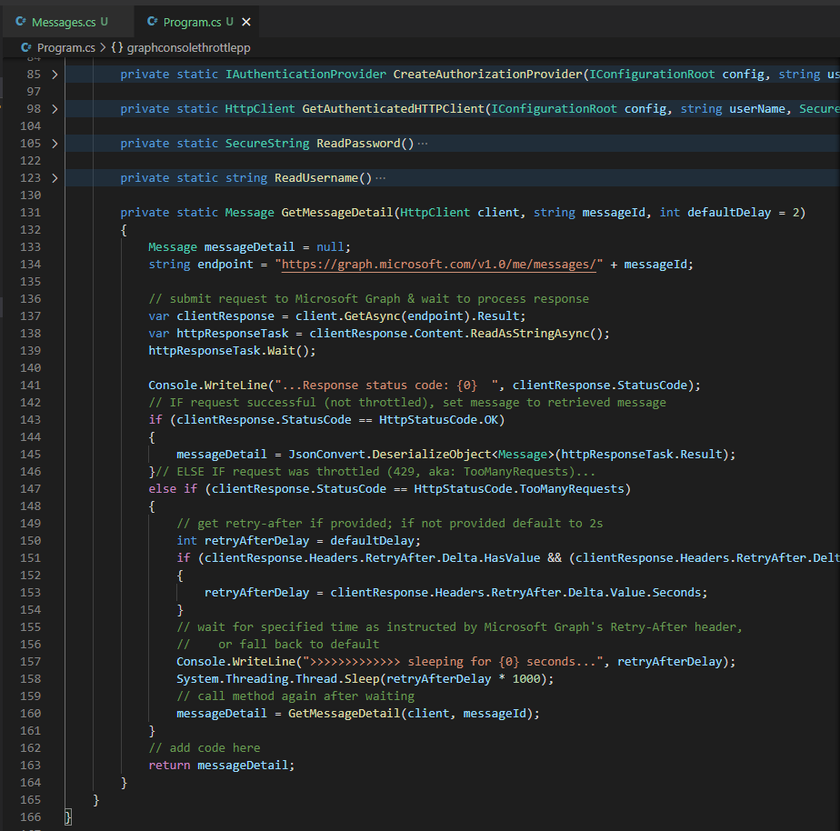

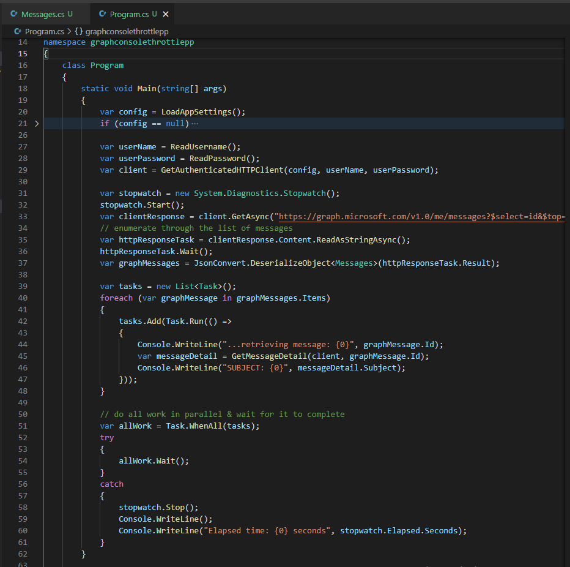

## Task 9: Build and test the updated application

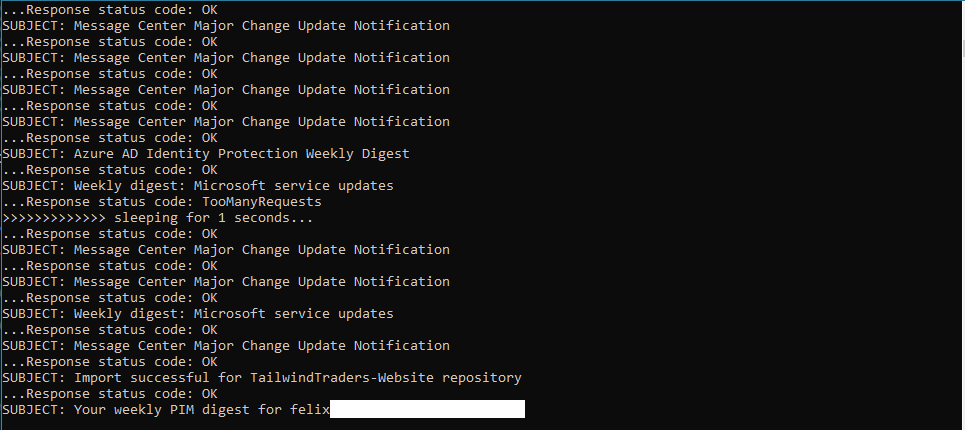

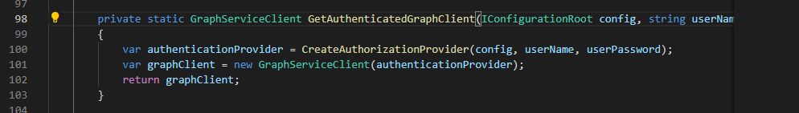

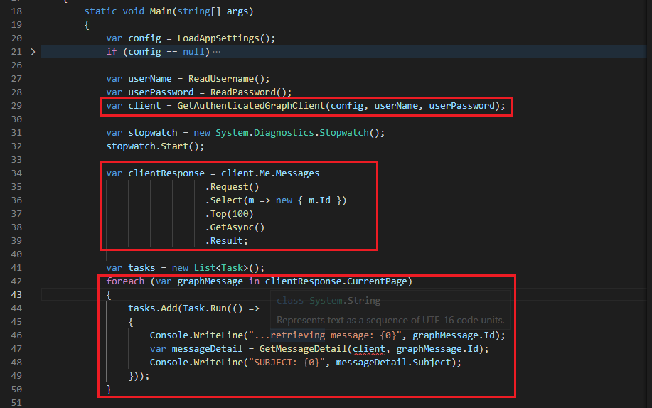

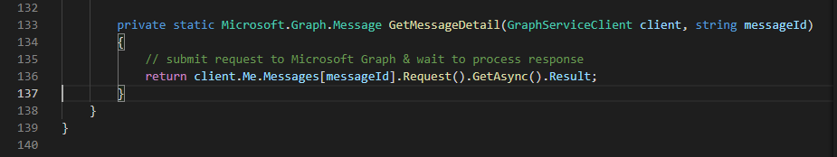

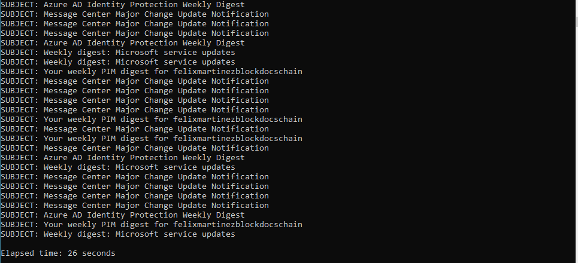
