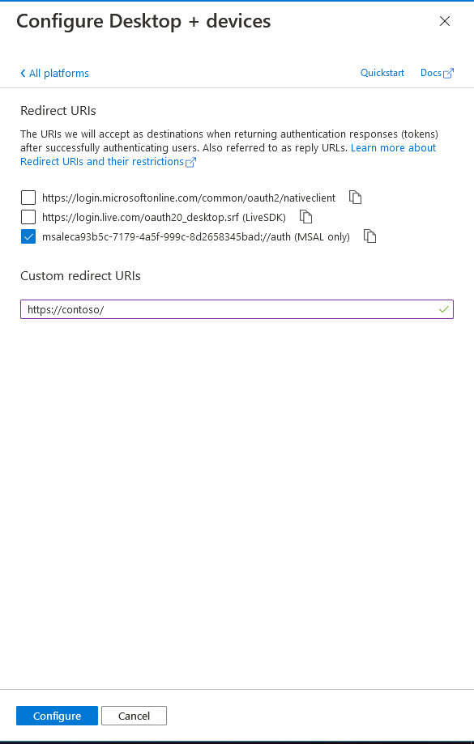

# Exercise 5: Understand throttling in Microsoft Graph

## Task 1: Create an Azure AD application

## Task 2: Grant Azure AD application permissions to Microsoft Graph

## Task 3: Create .NET Core console application

## Task 4: Update the console app to support Azure AD authentication

## Task 5: Create authentication helper classes

## Task 6: Incorporate Microsoft Graph into the console app

## Task 8: Implement Microsoft Graph SDK for throttling retry strategy

## Task 9: Build and test the updated application

