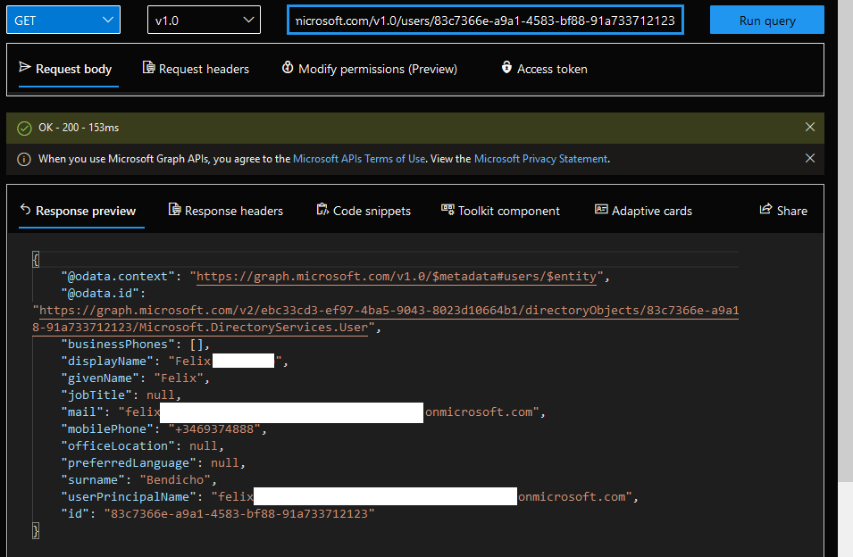
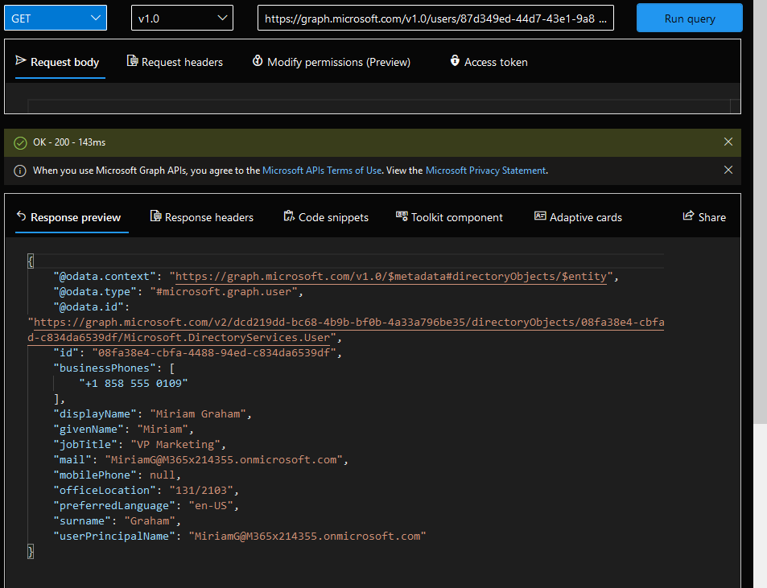

# Exercise 6: Querying user data from Microsoft Graph

## Task 3: Get a list of users in the organization

## Task 4: Get the user object based on the user’s unique identifier

## Task 5: Get the user's profile photo

## Task 6: Get the user's manager profile

