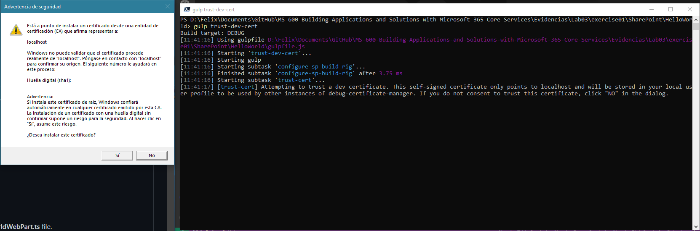

# Exercise 1: Introduction to SharePoint Framework (SPFx)

## Task 1: Set up your SharePoint Framework development environment

## Task 2: Creating a SharePoint Framework client-side web part

## Task 3: Test with the local and hosted SharePoint Workbench

