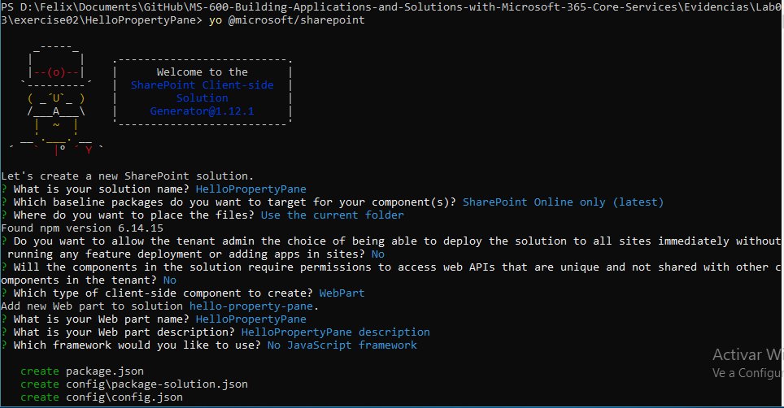
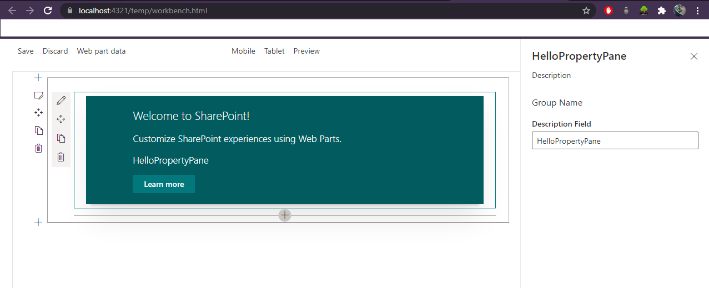
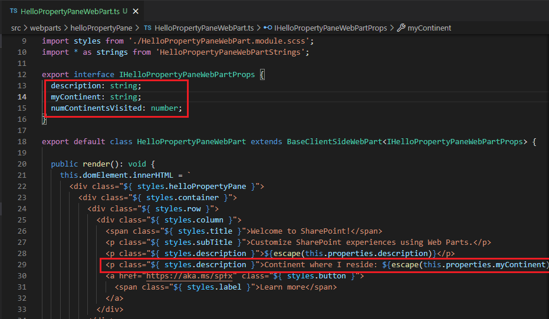
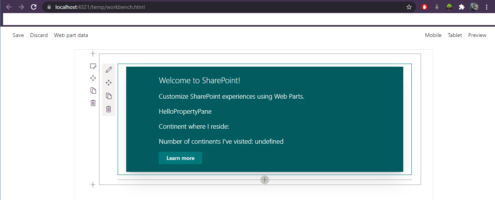
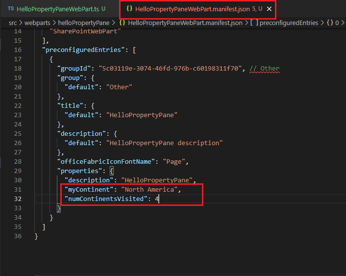
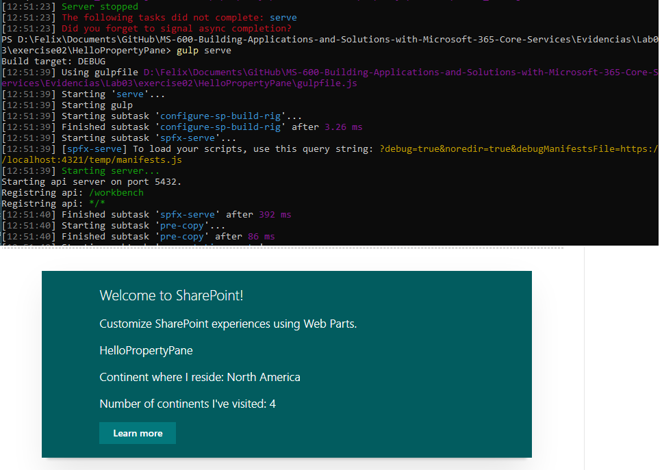
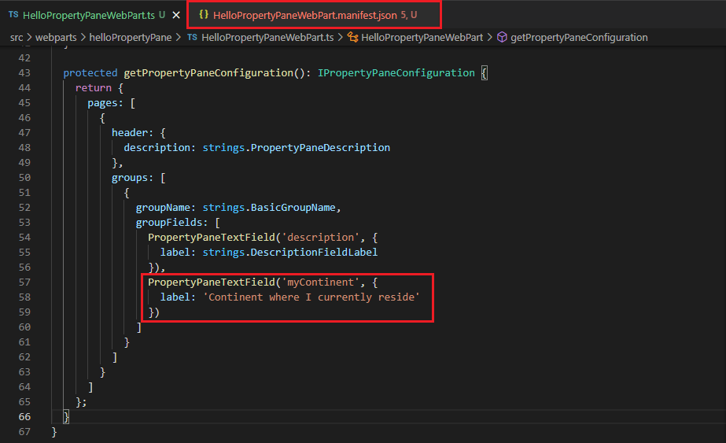
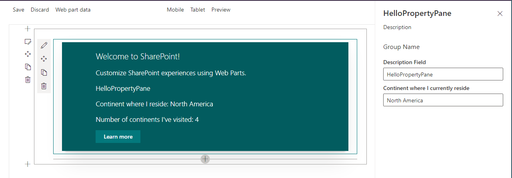
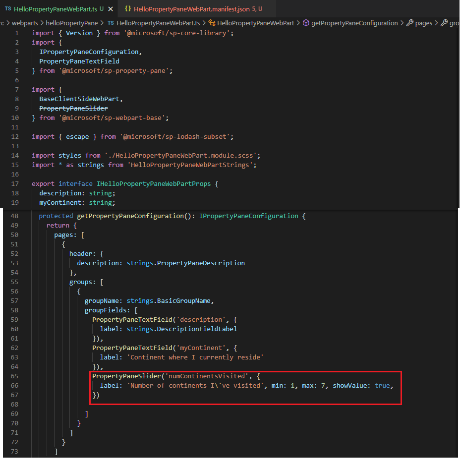
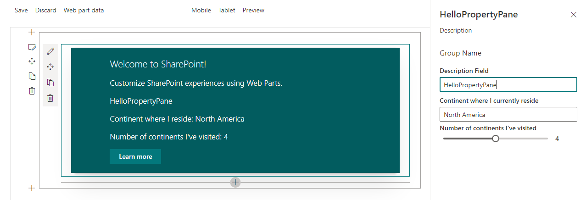

# Exercise 2: Working with the web part property pane

## Task 1: Create a new SPFx solution and web part

## Task 2: Add new properties to the web part

## Task 3: Extend the property pane

