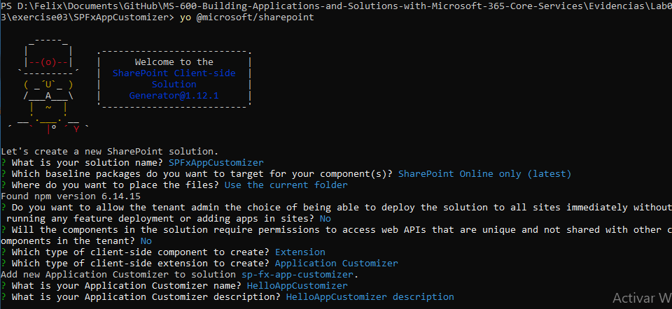
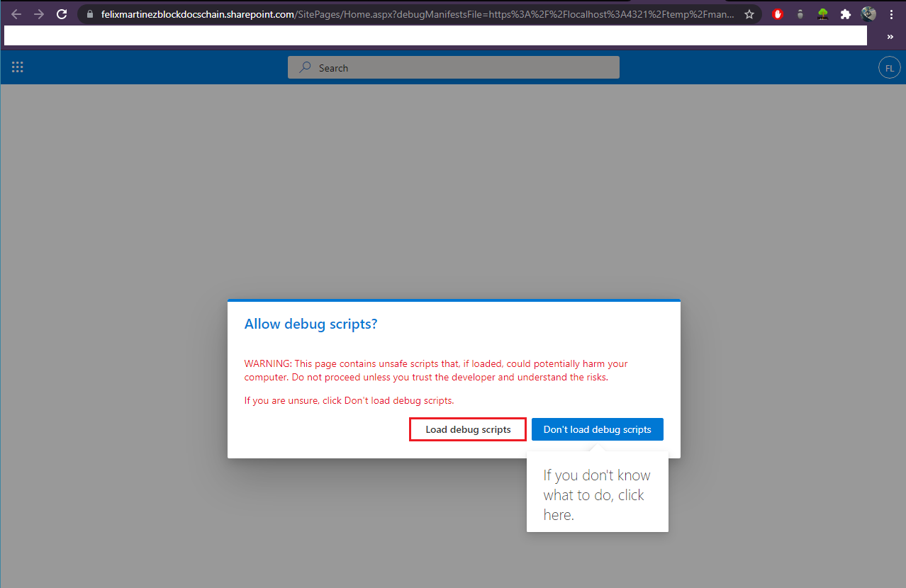
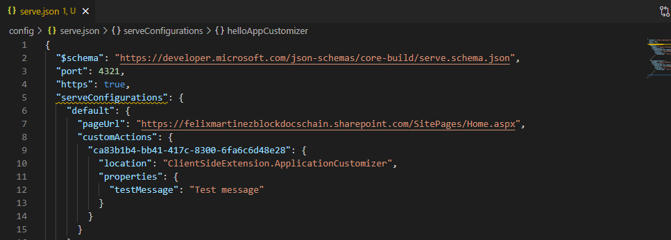
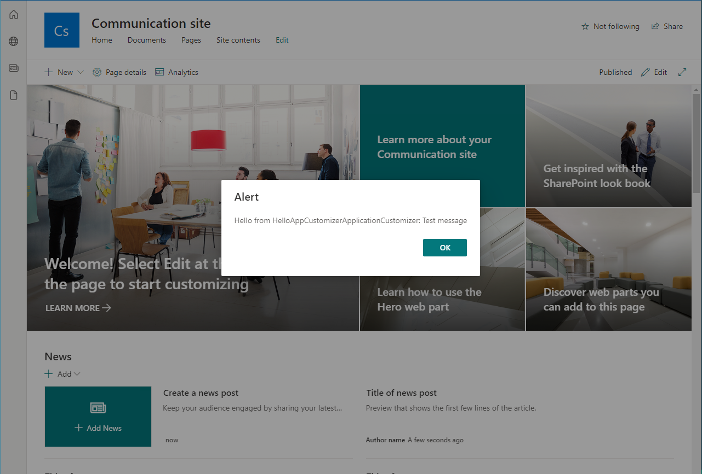
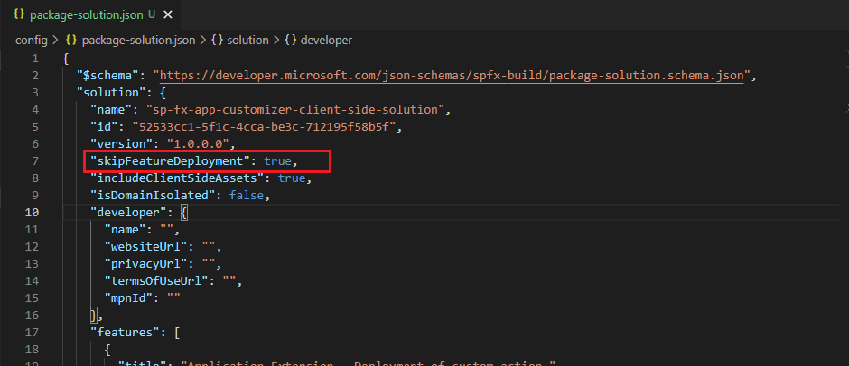
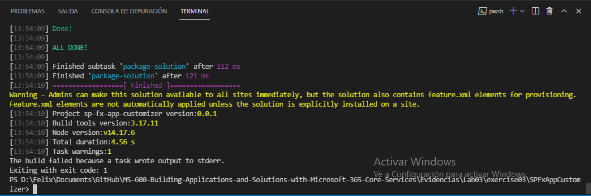
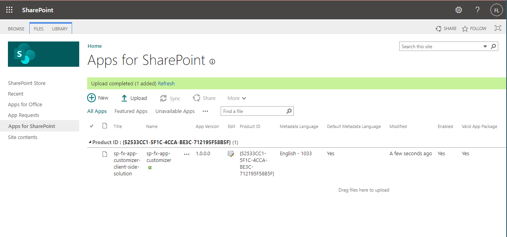
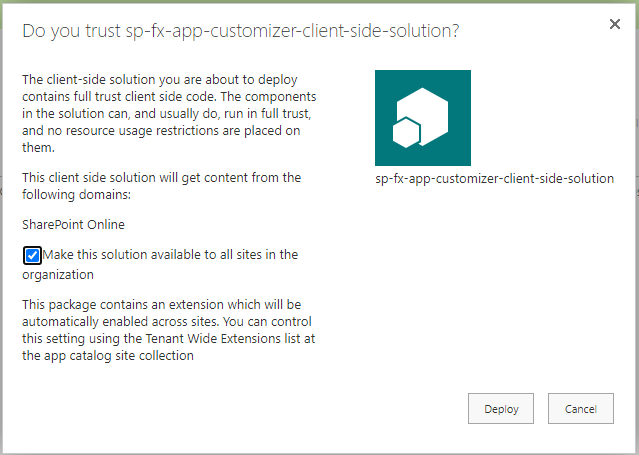
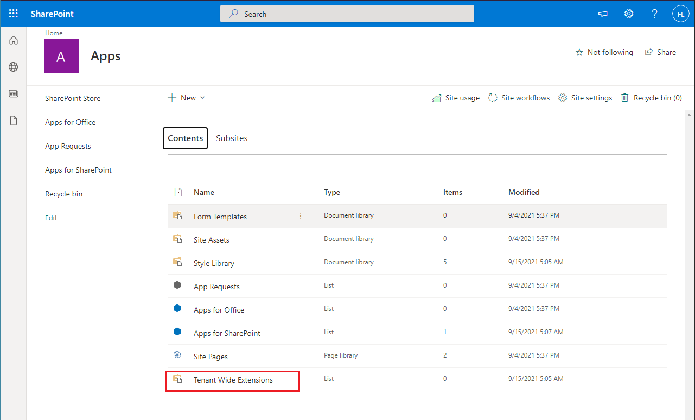
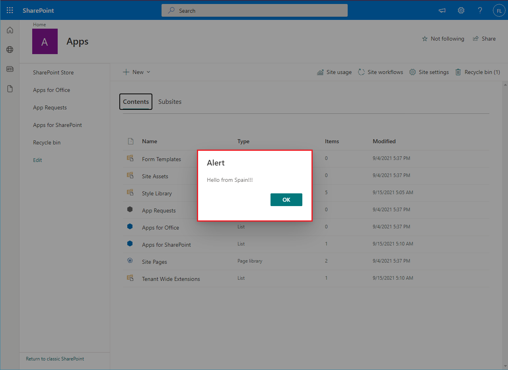

# Exercise 3: Creating SharePoint Framework Extensions

## Task 1: Create your project

## Task 2: Test your extension

## Task 3: Deploying your extension to all sites in the SharePoint Online tenant

