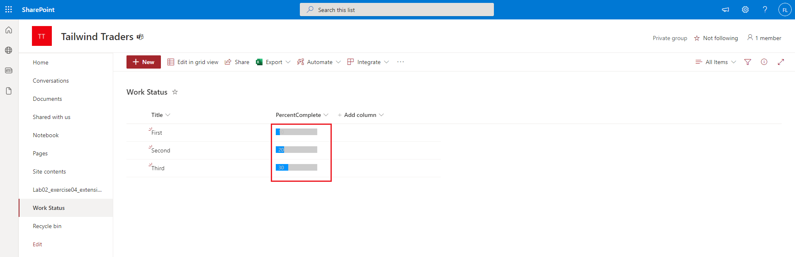

# Exercise 5: Creating a field customizer extension

## Task 2: Updating the SCSS styles for the field customizer

## Task 3: Update the code for the field customizer

## Task 5: Testing your field customizer

