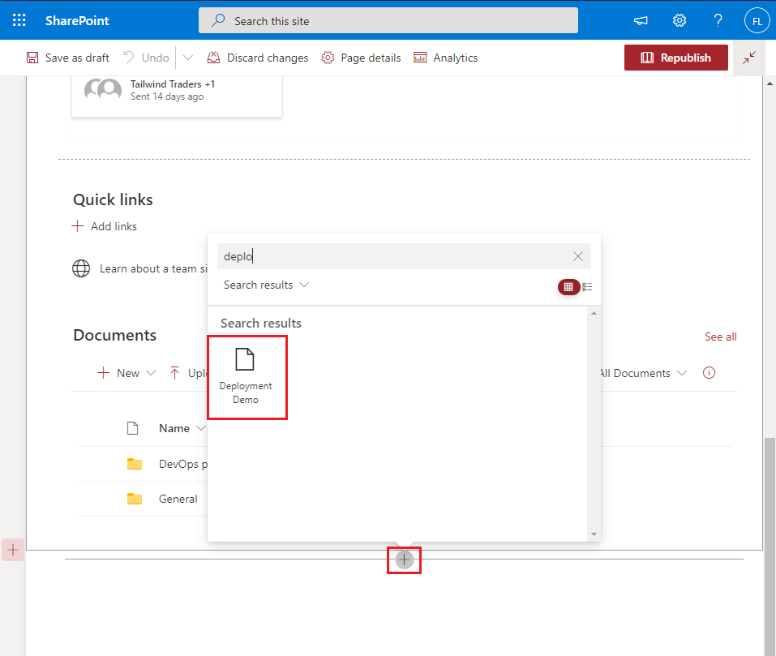

# Exercise 6: Deploying a SharePoint Framework solution

## Task 3: Deploying the package to a SharePoint site

## Task 4: Installing the SharePoint package in a site collection

## Task 5: Adding the web part to a page

## Task 6: Examining the deployed web part files
