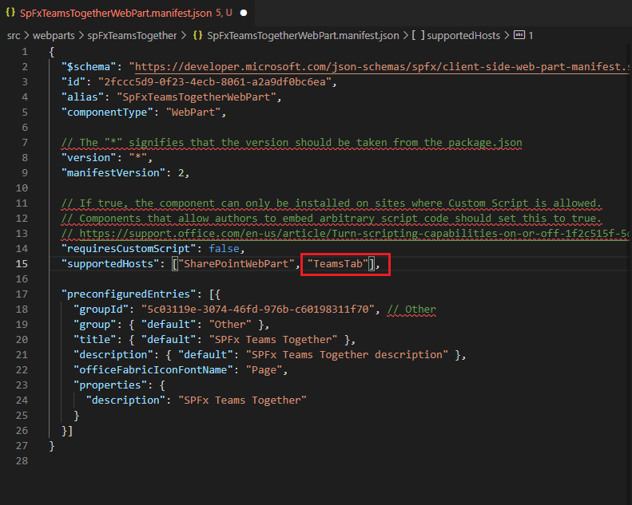
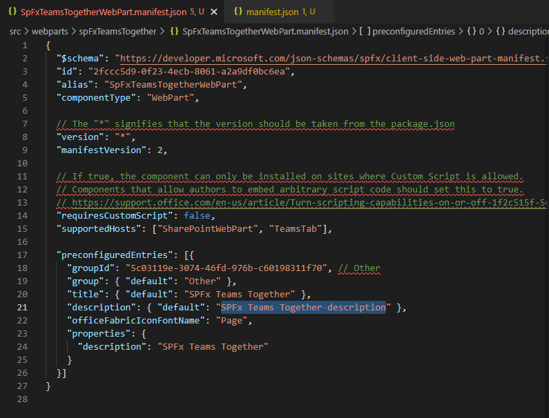
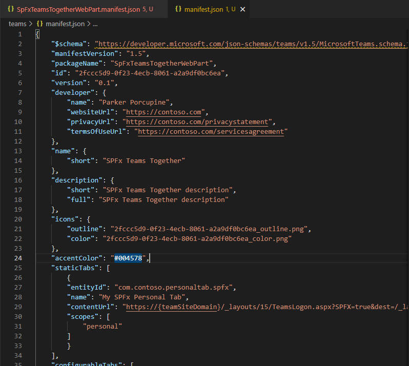
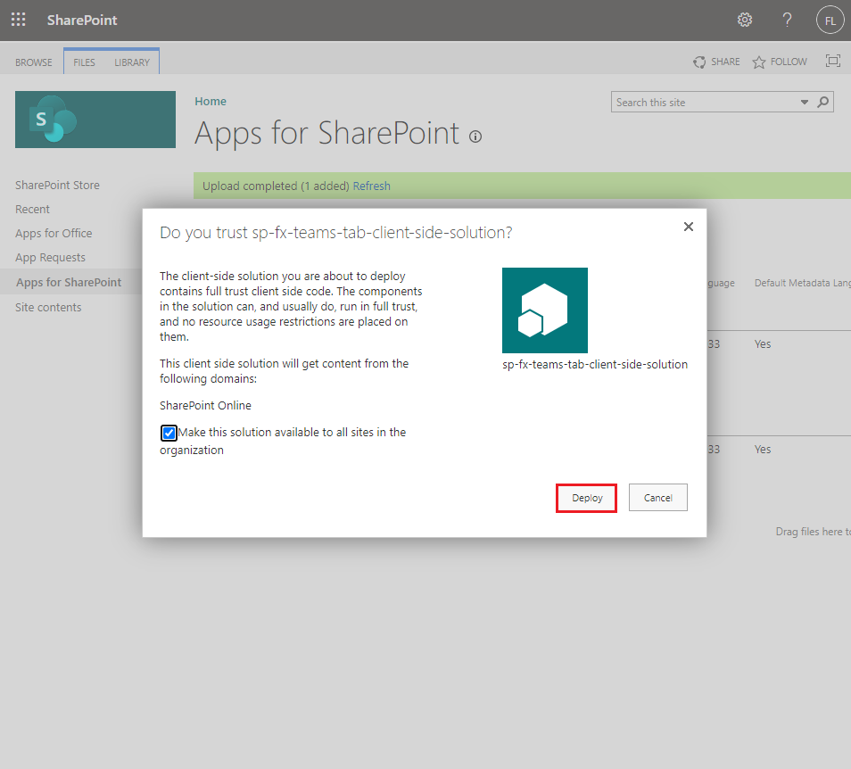
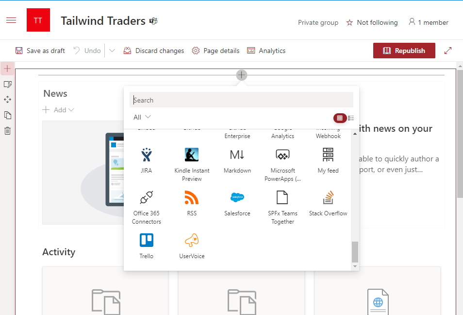
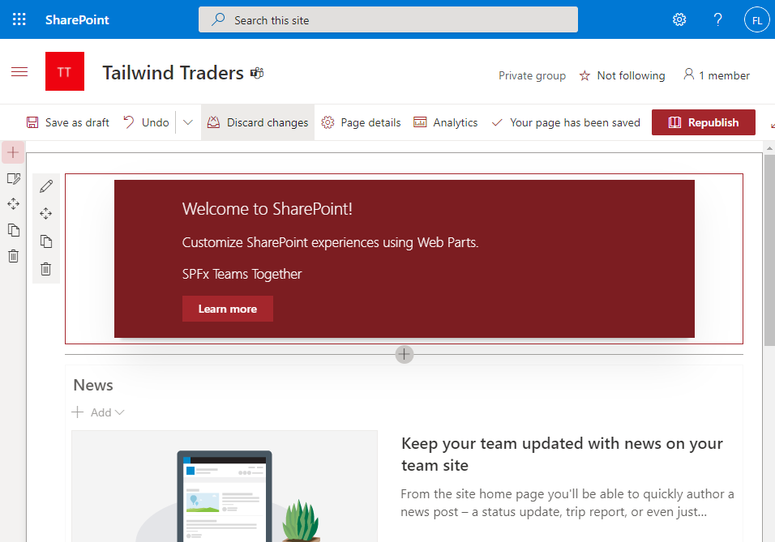
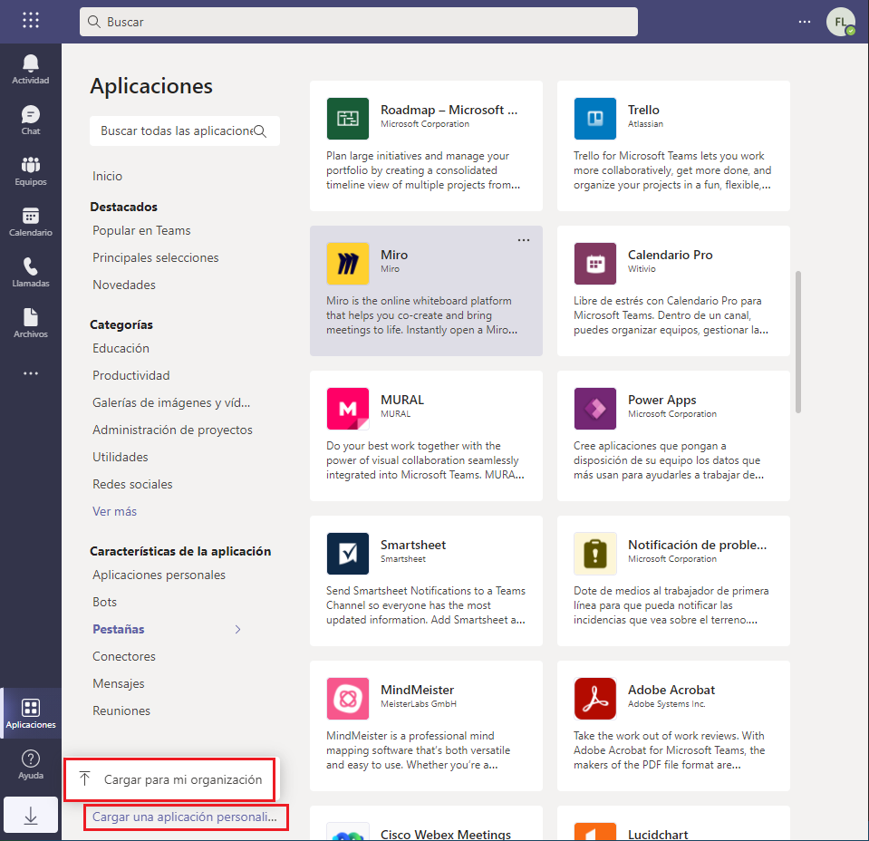
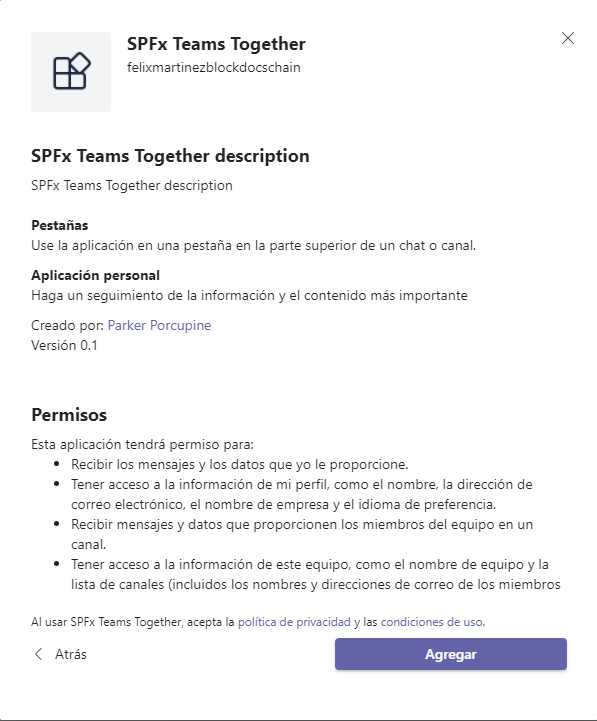
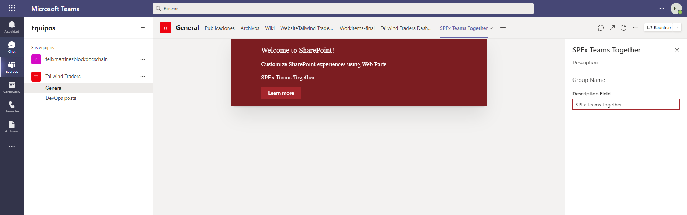

# Exercise 7: Deploying SPFx solutions to Microsoft Teams

## Task 2: Creating and deploying the Microsoft Teams app package

## Task 3: Create and deploy the SharePoint package

## Task 4: Test the web part in SharePoint and Microsoft Teams

## Task 5: Testing the SPFx web part in Microsoft Teams

