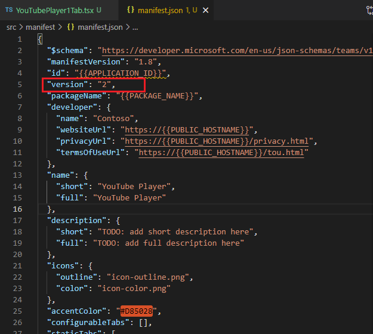
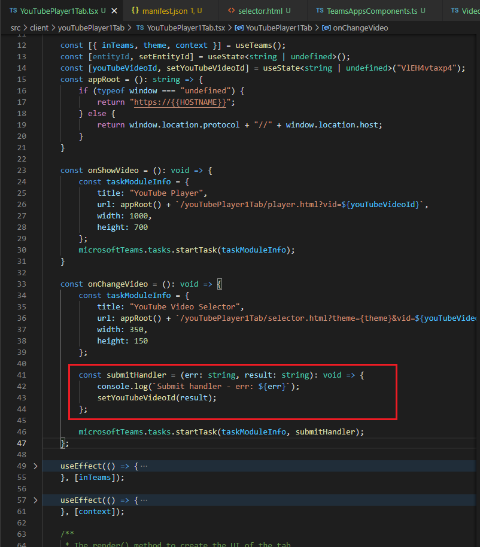

# Exercise 1: Collecting user input with task modules

## Task 1: Create Microsoft Teams app

### Test the personal tab

### Implement the personal tab's user interface

### Test the personal tab

## Task 2: Add video player task module

### Test the video player task module

## Task 3: Add video selector task module

### Implement the React app for the selector task module

### Test the video selector task module

