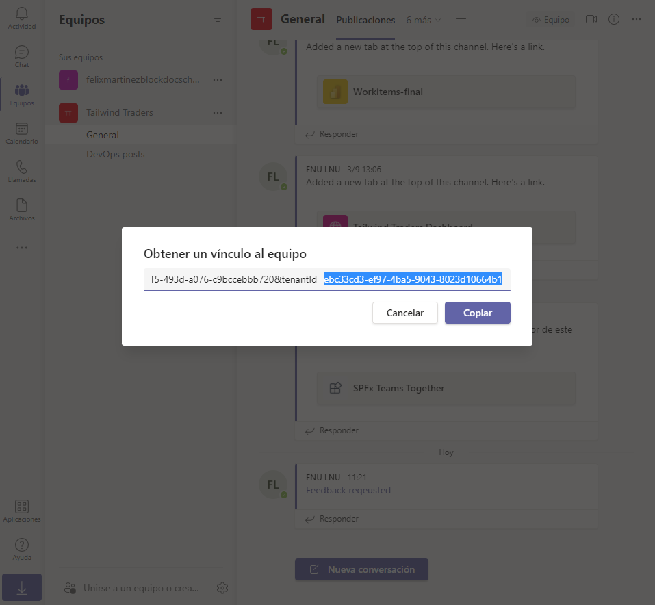

# Exercise 2: Using adaptive cards and deep links in task modules

## Task 1: Create video selector as an adaptive card

## Task 2: Create a new task module that uses the Adaptive Card

### Test the Adaptive Card task module

## Task 3: Invoking task modules with deep links

## Summary

In this exercise, you learned how to use adaptive cards in a custom task module in a custom Microsoft Teams app. You also learned how to invoke task modules from anywhere within Microsoft Teams using deep links.
