# Exercise 4: Creating outgoing webhooks

## Task 1: Create Microsoft Teams app

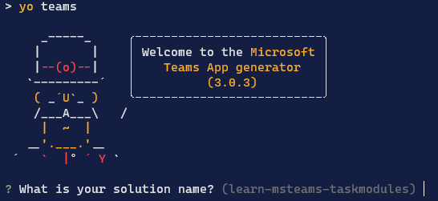

## Task 2: Code the outgoing webhook

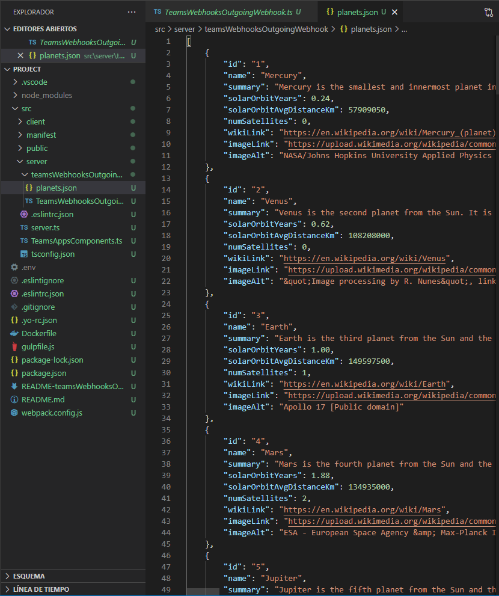

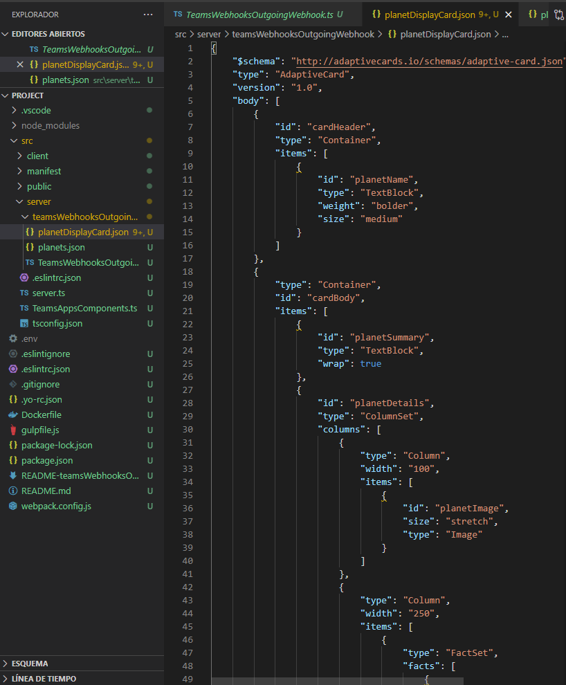

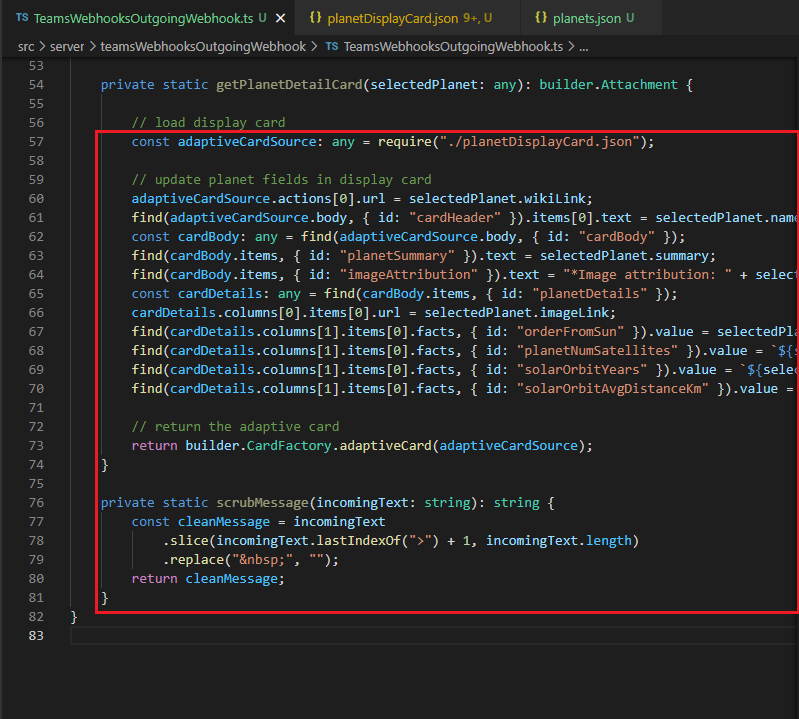

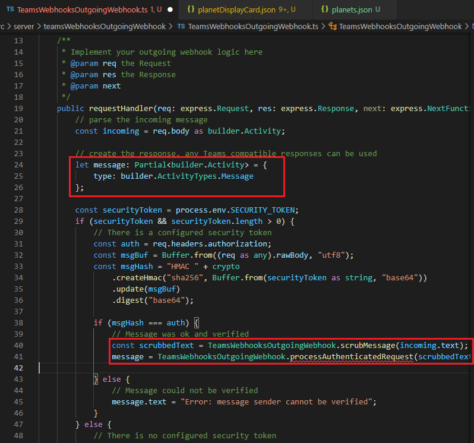

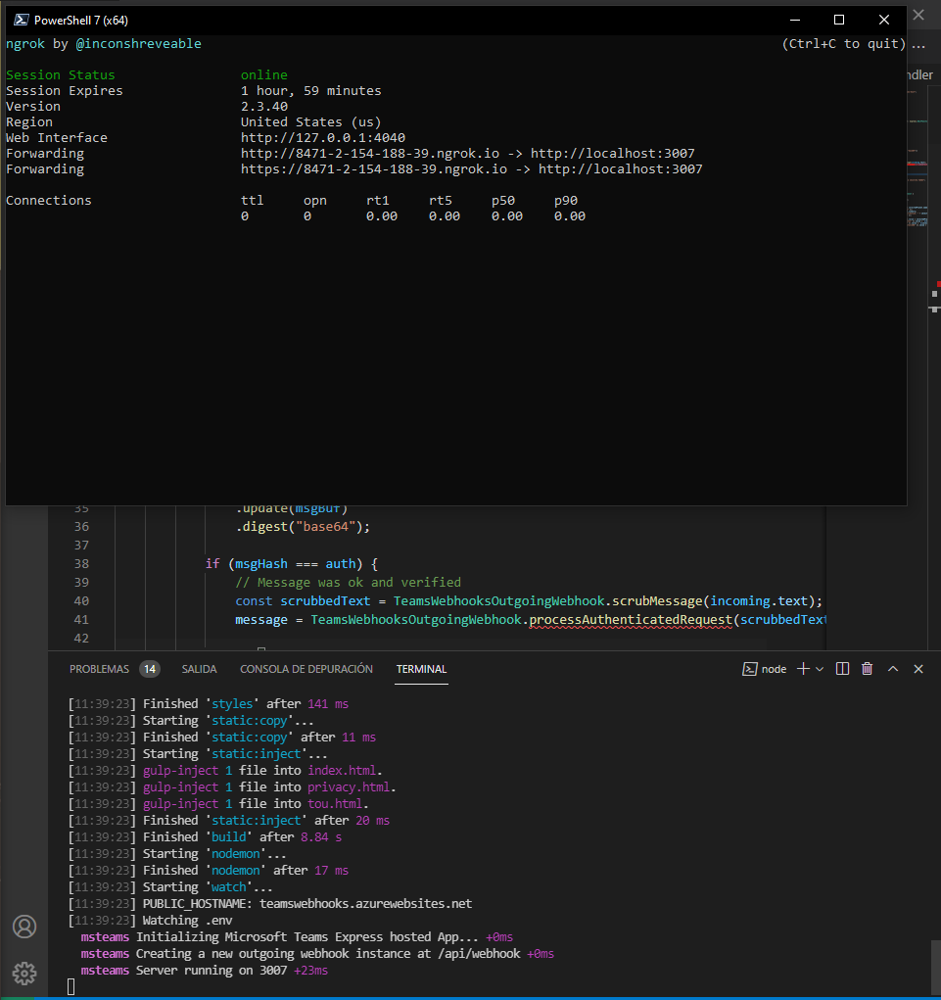

## Task 3: Test the outgoing webhook

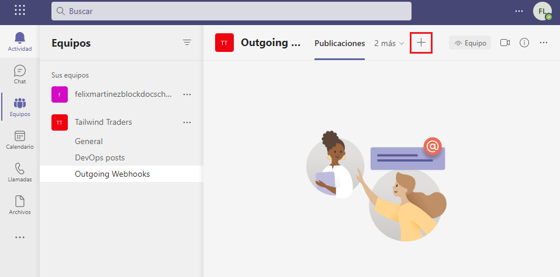

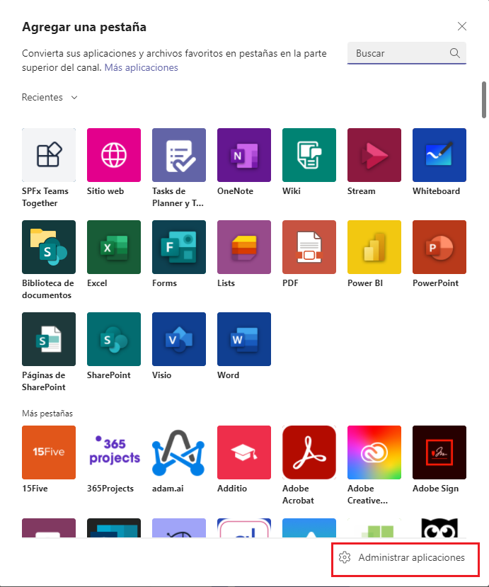

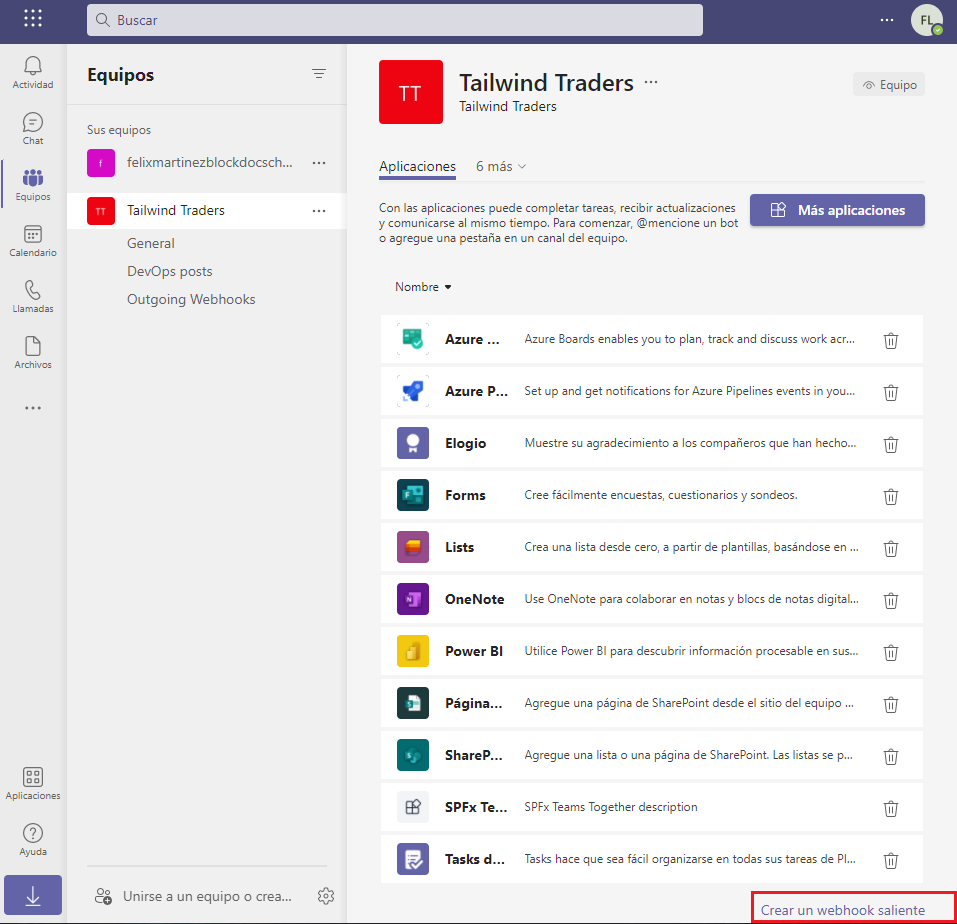

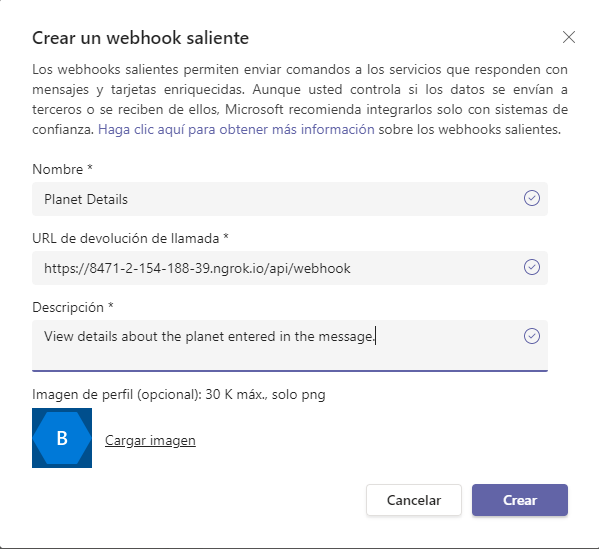

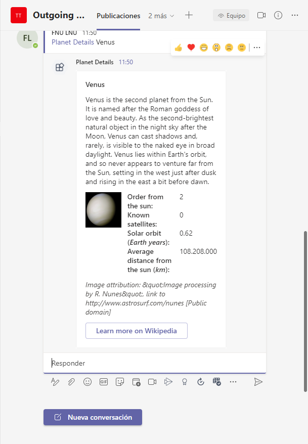

## Summary

In this exercise, you learned how to create a web service and register it as an outgoing webhook in Microsoft Teams.
