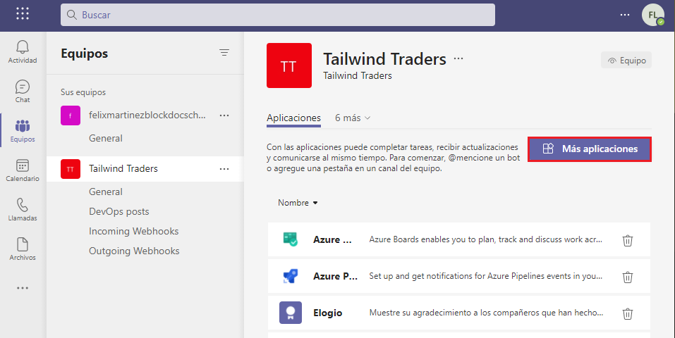
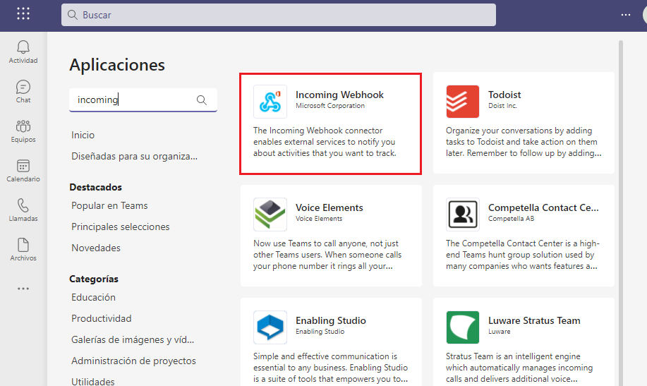
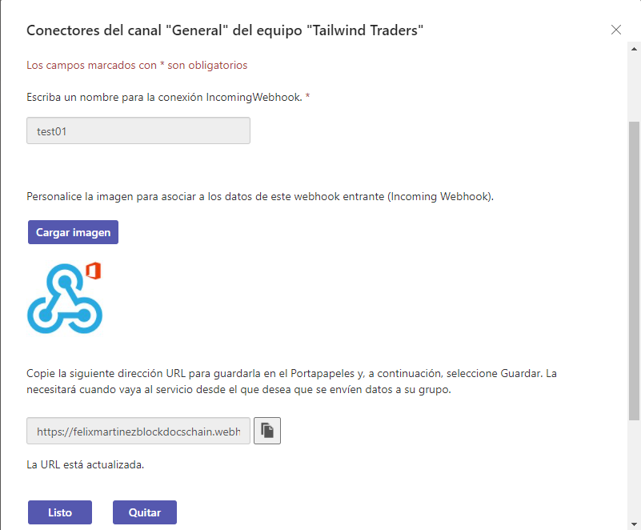
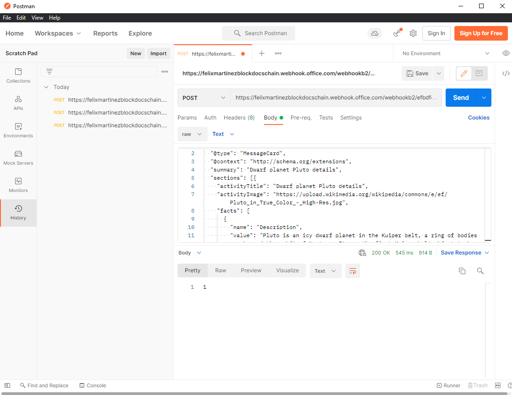
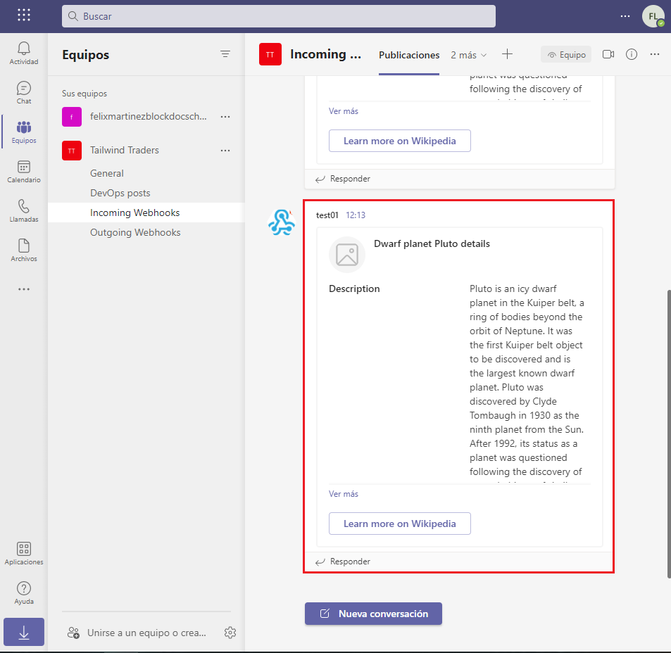

# Exercise 5: Creating incoming webhooks

## Task 1: Register a new incoming webhook

## Task 2: Test the incoming webhook

## Summary

In this exercise, you learned how to register an incoming webhook in a Microsoft Teams channel and post a message to it.
