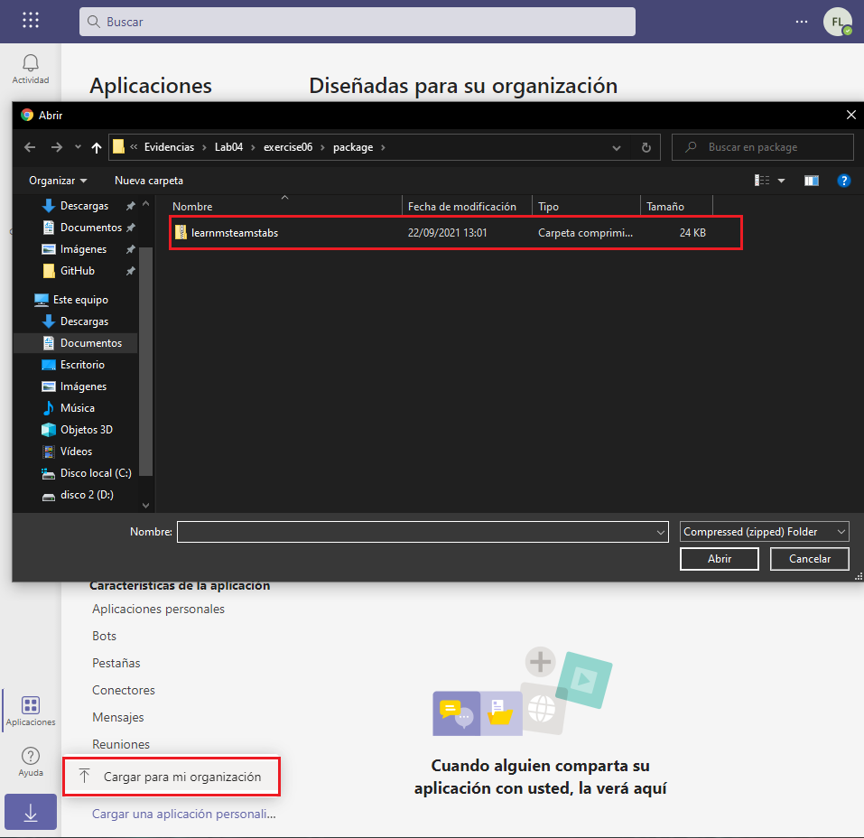
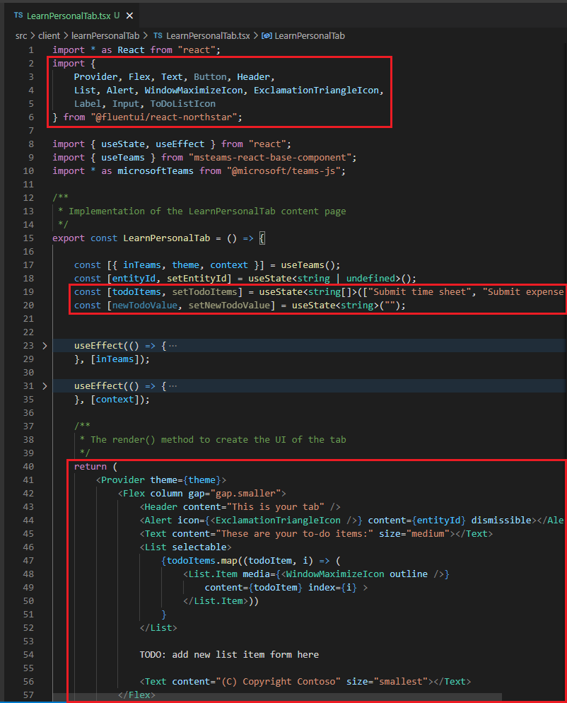
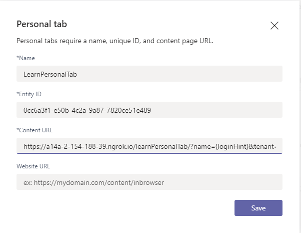

# Exercise 6: Create a custom Microsoft Teams personal tab

## Task 1: Create Microsoft Teams app

## Task 2: Test the personal tab

## Task 3: Implement the personal tab's user interface

## Task 4: Use App Studio to update the Microsoft Teams app manifest

## Task 5: Install and test the Microsoft Teams app

## Summary

In this exercise, you created a new Microsoft Teams personal tab by using the Microsoft Teams Yeoman generator, Visual Studio Code, and App Studio.