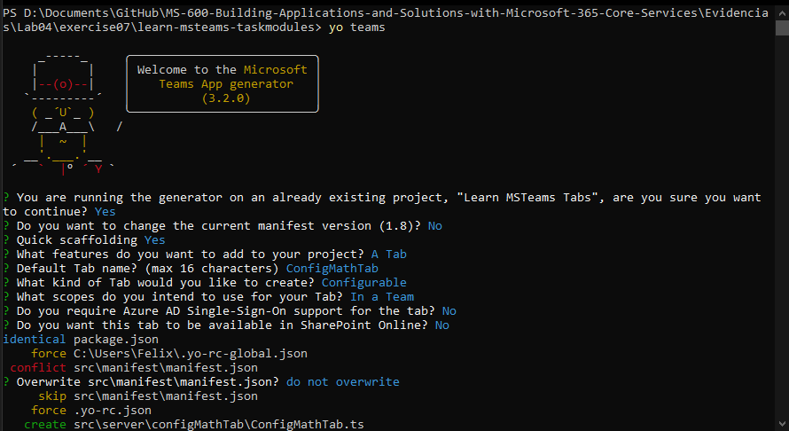

# Exercise 7: Create a custom Microsoft Teams channel tab

## Task 1: Add a channel app to the Microsoft Teams app project

## Task 2: Test the channel tab

## Task 3: Update the configuration tab

### Implement the configuration page logic and user interface

### Test the configuration page

## Task 4: Implement the channel tab

### Update the channel tab to use the Stardust UI library

### Implement the channel page logic

### Implement the channel page user interface

### Test the channel tab page

## Summary

In this exercise, you created a channel tab with a configuration page in a Microsoft Teams app.

