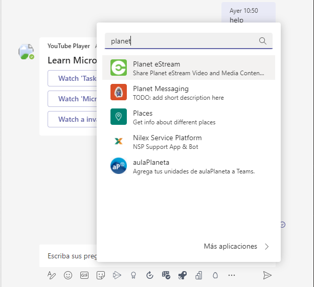

# Exercise 8: Creating action command messaging extensions

## Task 1: Register a new bot in Microsoft Azure

## Task 2: Create Microsoft Teams app

## Task 3: Register the messaging extension in the Microsoft Teams app

## Task 4: Code the messaging extension

## Task 5: Test the conversation bot

## Summary

In this exercise, you created an action command messaging extension for a custom Microsoft Teams app.
