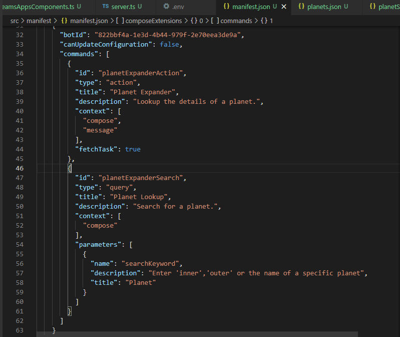
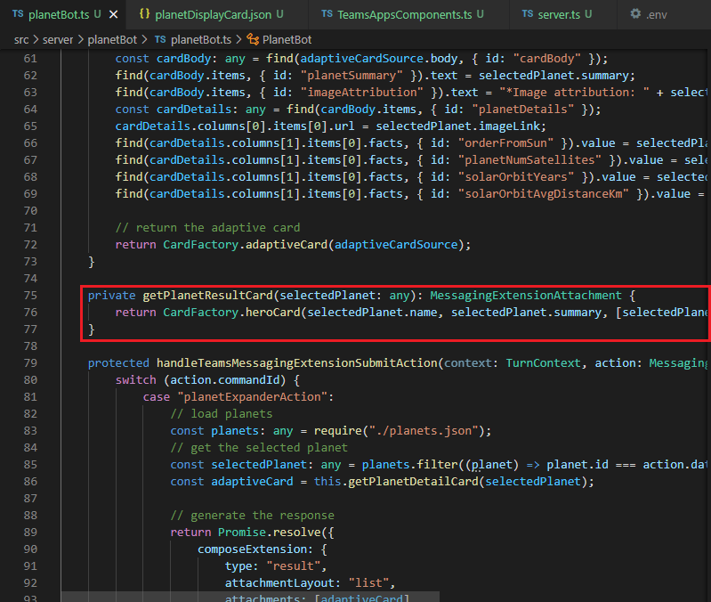
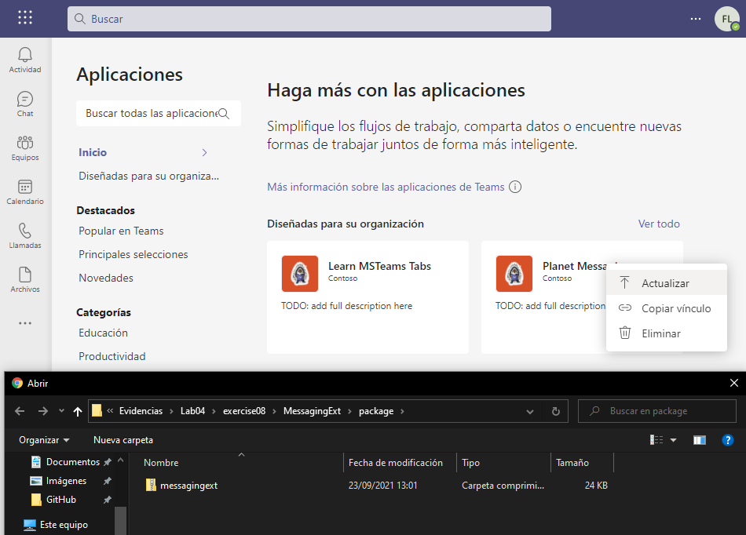
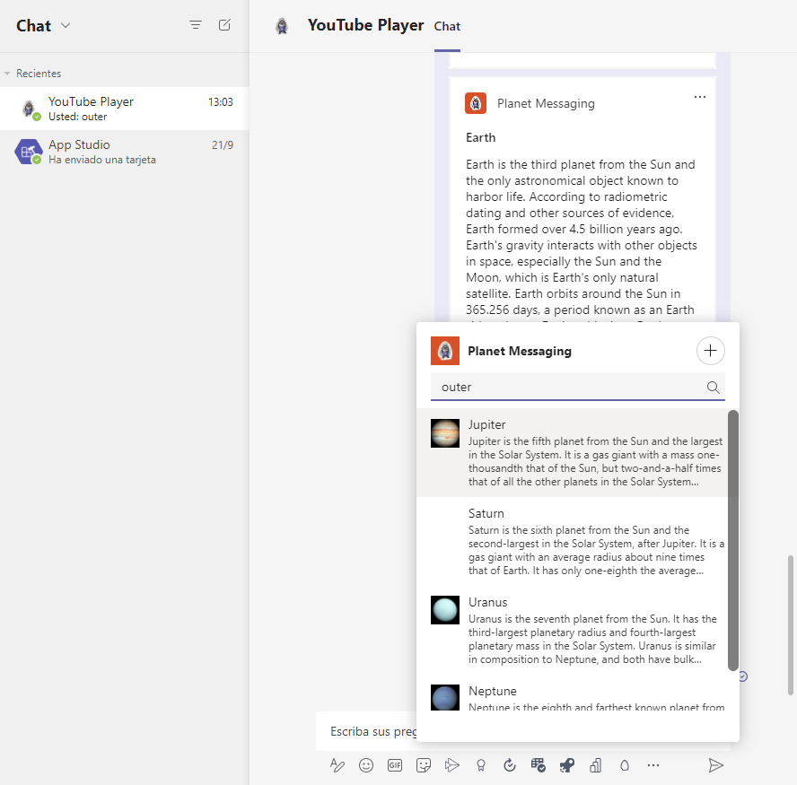

# Exercise 9: Creating search command messaging extensions

## Task 1: Add a new search messaging extension to the Teams app

### Update the app's configuration

### Update the bot code

### Test the updated messaging extension

## Summary

In this exercise, you learned how to execute a messaging extension search command from an existing message.
