# Exercise 10: Creating conversational bots

## Task 1: Register a new bot in Microsoft Azure

## Task 2: Create Microsoft Teams app

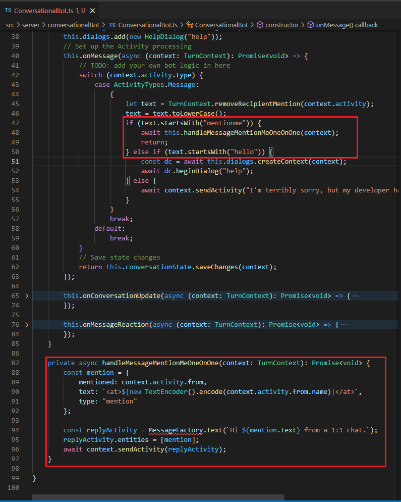

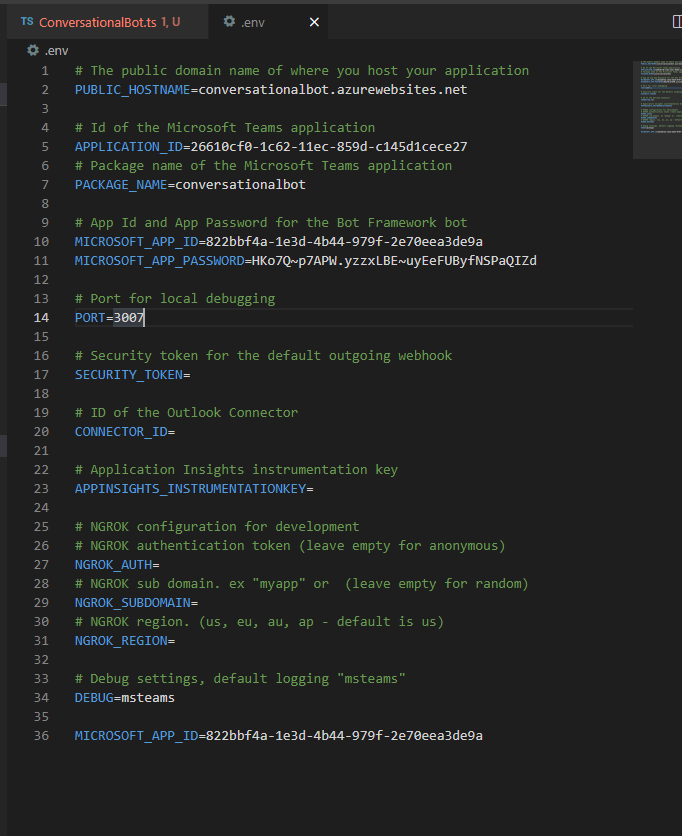

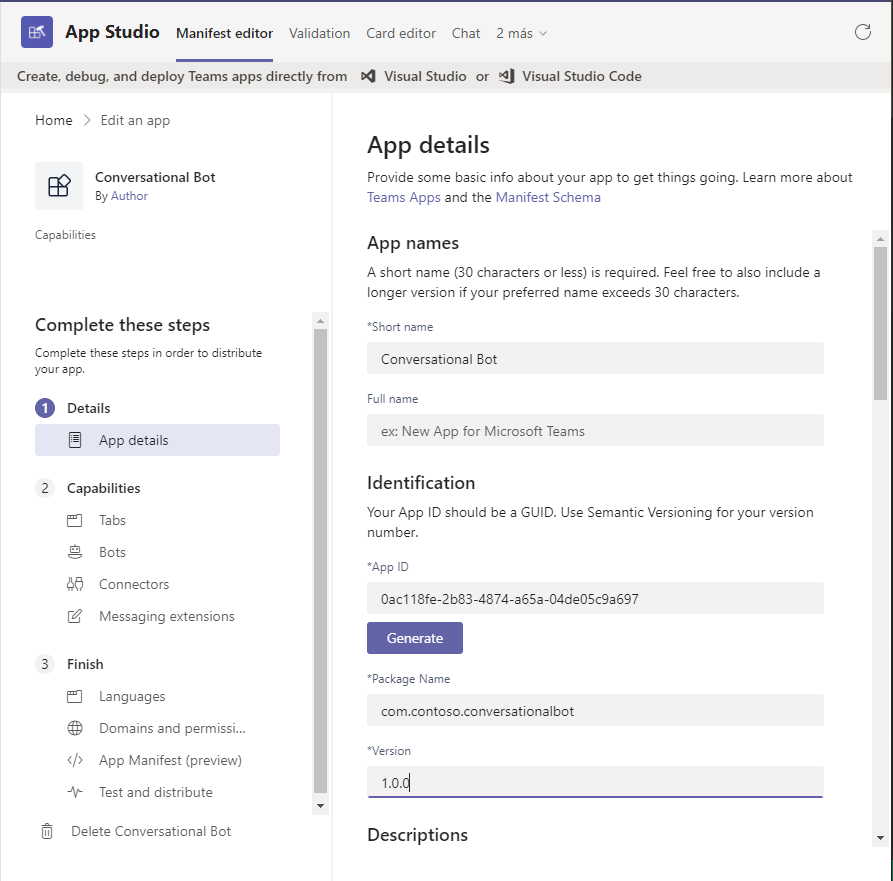

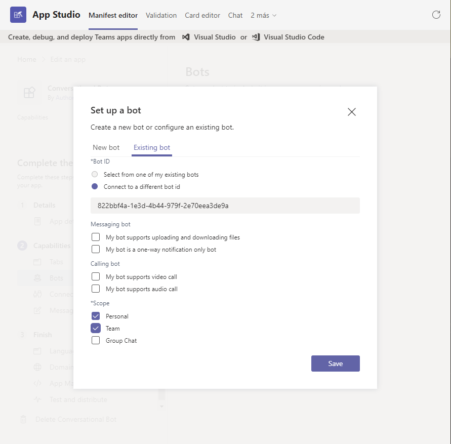

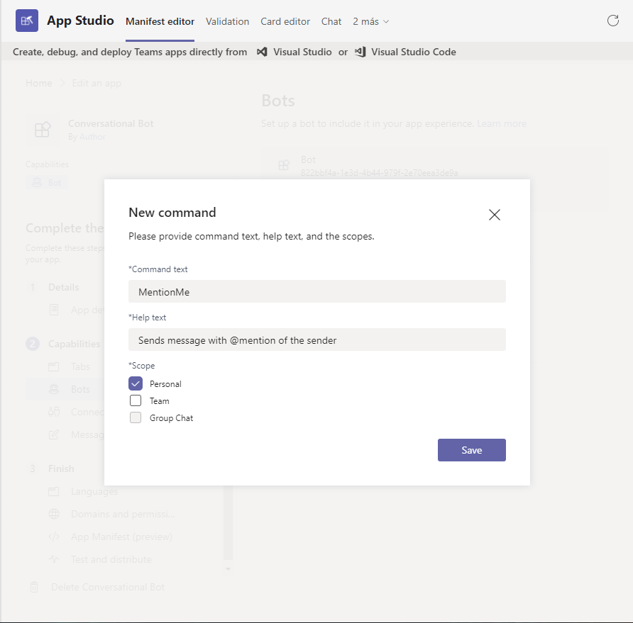

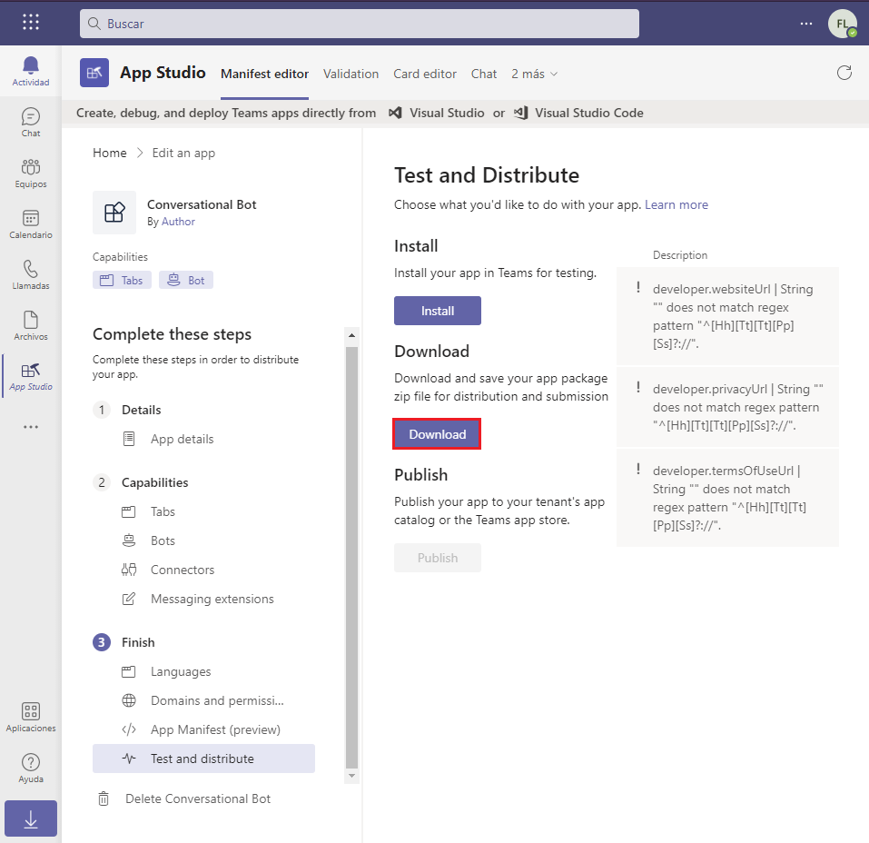

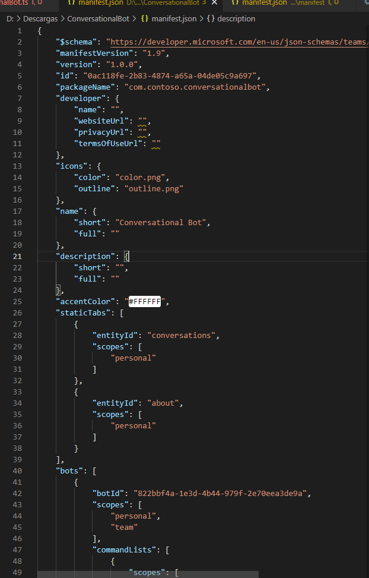

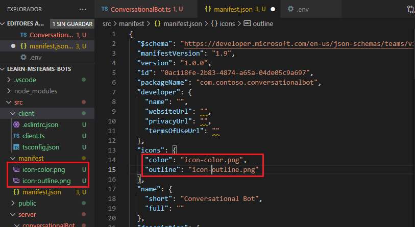

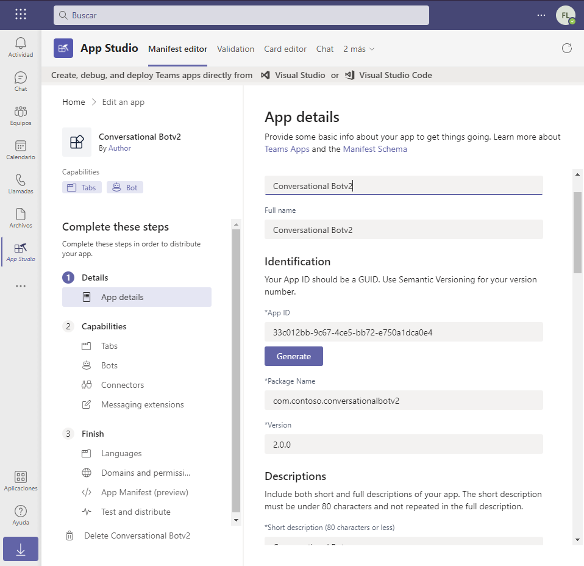

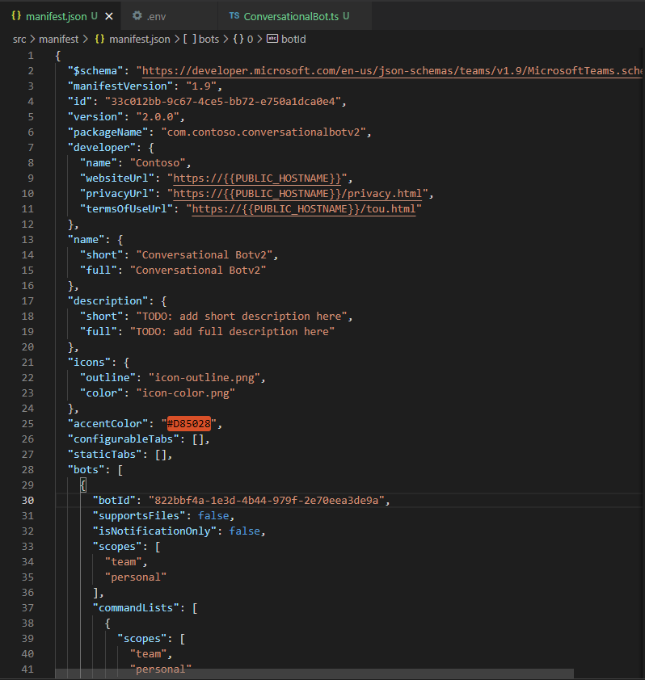

## Task 3: Test the conversational bot

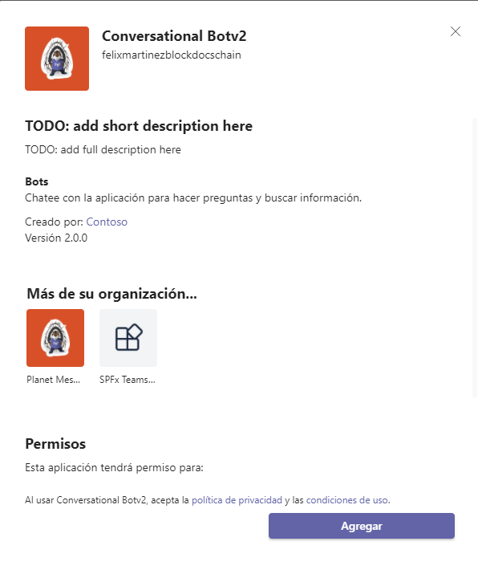

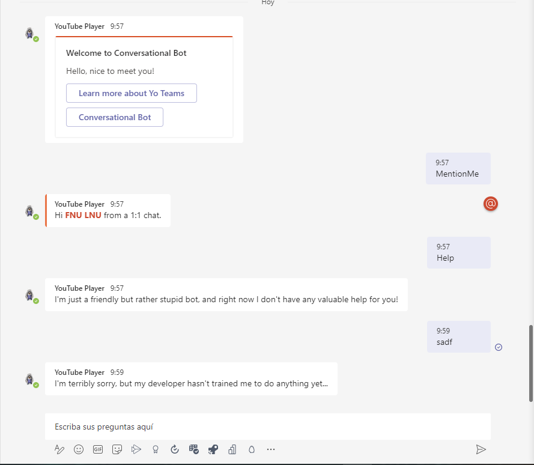

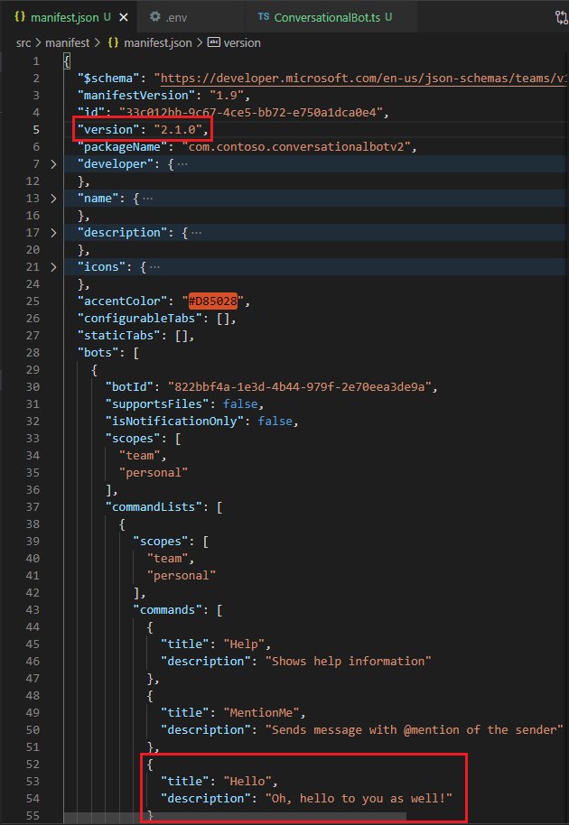

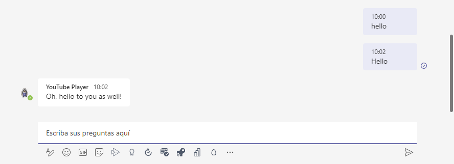

## Summary

In this exercise, you learned how to create and add a new bot to a Microsoft Teams app and interact with it from the Microsoft Teams client.
