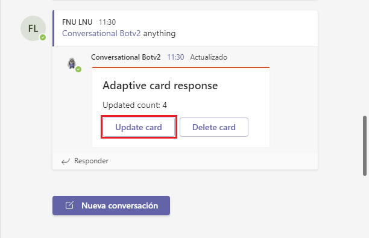

# Exercise 11: Bots in channels and group chats

## Task 1: Add channel support to a conversational bot

## Task 2: Reply to messages with Adaptive cards

## Task 3: Reply to message reactions

## Summary

In this exercise, you modified the existing Microsoft Teams app to update your bot to respond to message reactions, and update or delete messages capabilities.
