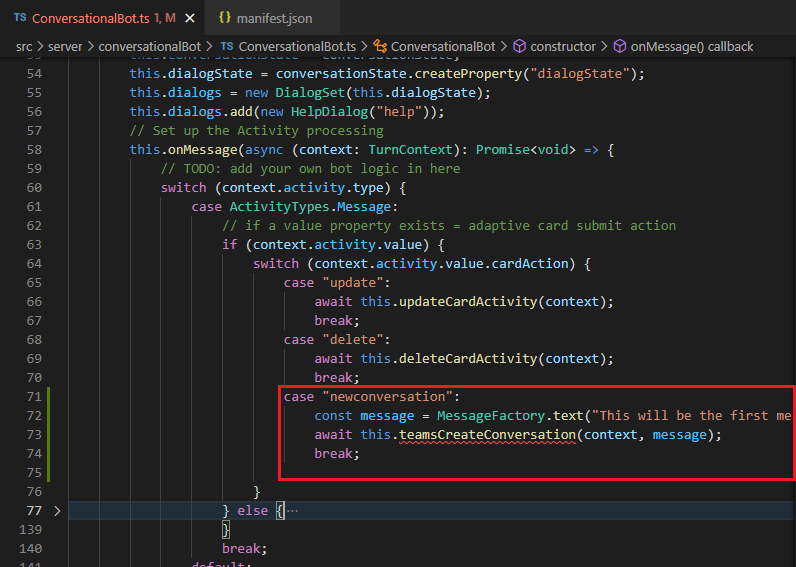

# Exercise 12: Sending proactive messages from bots

## Task 1: Send a proactive message from the bot

## Summary

In this exercise, you modified the existing Microsoft Teams app to send a proactive message from your bot.
