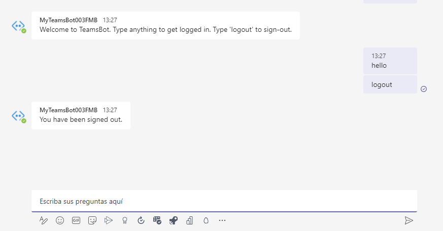

# Exercise 18: Implement single sign-on with Microsoft Teams bots

## Task 1: Update the Azure AD app

## Task 2: Register the bot with the Microsoft Azure Bot Framework

## Task 3: Create your Microsoft Teams app project

## Task 4: Code the bot

## Task 5: Build and test the application

## Summary

In this exercise, you learned how to create and add a new bot to a Microsoft Teams app and interact with it from the Microsoft Teams client while using the support for SSO.
